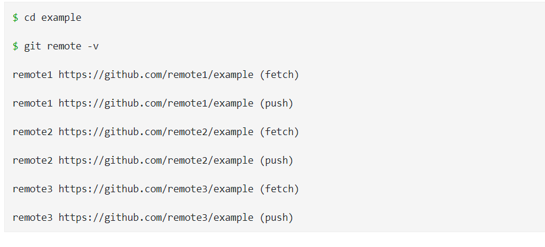
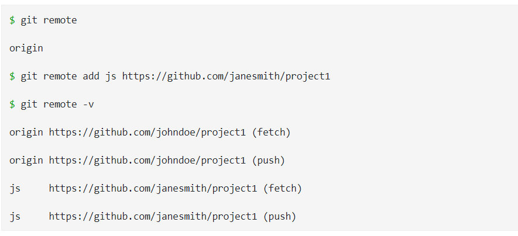

# _Git Remote Command_

***This command help you to  view the short names, maybe you understand it, while try the down samples of codes in your computer***

***Also you 'll need git remote -v command to view all the remote URLs next to their corresponding short names***

