# HTML

## Every web developer should ask himself many questions before designing the website, let’s talking about these questions.

***WHO IS THE SITE FOR?***

Every website should be designed for the target audience—not just for yourself or the site owner. It is therefore very important to understand who your target audience is.

***WHY PEOPLE VISIT YOUR WEBSITE?***

Now that you know who your visitors are, you need to consider why they are coming. While some people will simply chance across your website, most will visit for a specific reason.
You should know if the website is for individuals or for on company, this helps you to know how you can do your work perfectly many things such as ages or age range of the targeted people, what is the average of their income, the size of the company and their budget. 

- Key Motivations such as:
 Are they looking for general entertainment or do they need to achieve a specific goal?
- Specific Goals:
Are they already familiar with the service or product that you offer or do they need to be introduced to it?

***What Your Visitors are Trying to Achieve?***

It is unlikely that you will be able to list every reason why someone visits your site but you are looking for key tasks and motivations. This information can help guide your site designs.
First you want to create a list of reasons why people would be coming to your site, let’s check two of them:
1.	Jasper had a bad experience staying in a hotel when visiting Sydney, Australia, and wants to make a complaint
1.	Ivy is a picture editor and wants to look at a photographer's site to see examples of his work before deciding whether to commission him.

***What Information Your Visitors Need?***
You know who is coming to your site and why they are coming, so now you need to work out what information they need in order to achieve their goals quickly and effectively.
You may want to offer additional supporting information that you think they might find helpful. Look at each of the reasons why people will be visiting your site and determine what they need to achieve their goals.

***HOW OFTEN PEOPLE WILL VISIT YOUR SITE?***

Some sites benefit from being updated more frequently than others. Some information (such as news) may be constantly changing, while other content remains relatively static.
A website about fashion trends will need to change a lot more frequently than one that is promoting a service that people do not buy regularly (such as domestic plumbing or double glazing).

***SITE MAPS***
Now that you know what needs to appear on your site, you can start to organize the information into sections or pages.
The aim is to create a diagram of the pages that will be used to structure the site. This is known as a site map and it will show how those pages can be grouped.

_EXAMPLE SITE MAP_

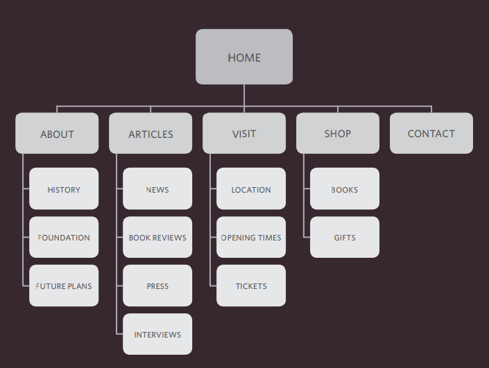

***WIREFRAMES:***

A wireframe is a simple sketch of the key information that needs to go on each page of a site. It shows the hierarchy of the information and how much space it might require.

*Example Wireframe*

***GETTING YOUR MESSAGE ACROSS USING DESIGN***

The primary aim of any kind of visual design is to communicate. Organizing and prioritizing information on a page helps users understand its importance and what order to read it in.
1.	Content.
1.	Prioritizing.
1.	Organizing.
1.	Visual hierarchy.
    1. Size: Larger elements will grab users' attention first.
    1. Color: Foreground and background color can draw attention to key messages.
    1.	Style: An element may be the same size and color as surrounding content but have a different style applied to it to make it stand out.

1. 	Grouping.
1.	Similarity.

### *Here a summary helps you to reach a good point in understanding what I am talking about:*

1.	It's important to understand who your target audience is, why they would come to your site, what information they want to find and when they are likely to return.
1.	Site maps allow you to plan the structure of a site.
1.	Wireframes allow you to organize the information that will need to go on each page.
1.	Design is about communication. Visual hierarchy helps visitors understand what you are trying to tell them.
1.	You can differentiate between pieces of information using size, color, and style.
1.	You can use grouping and similarity to help simplify the information you present.

## ***Now I’ll tell you about HTML5:***

HTML5 is introducing a new set of elements that help define the structure of a page.

 **Traditional HTML5 Layout:**

 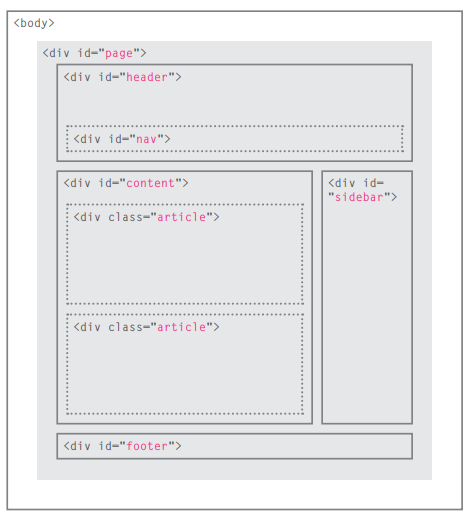 

**New HTML5 Layout:**

*HTML5 introduces a new set of elements that allow you to divide up the parts of a page. The names of these elements indicate the kind of content you will find in them. They are still subject to change, but that has not stopped many web page authors using them already.*

* Headers & Footers:

* Navigation:

* Articles:

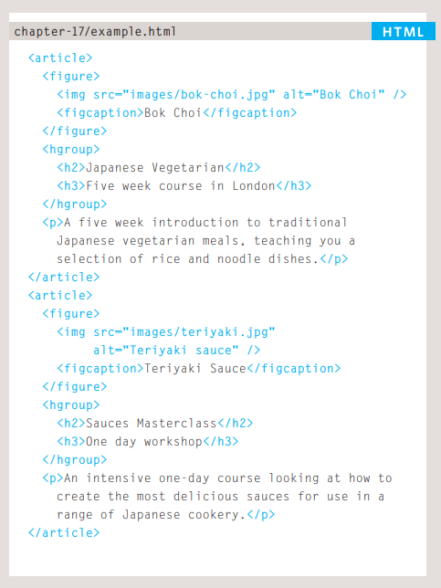

* Asides:

* Sections:

* Heading Groups:

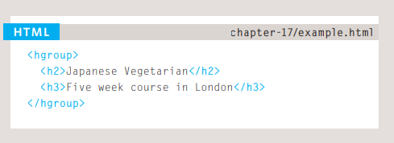

* Figures:

* Sectioning Elements:

* Linking Around Block-Level Elements:

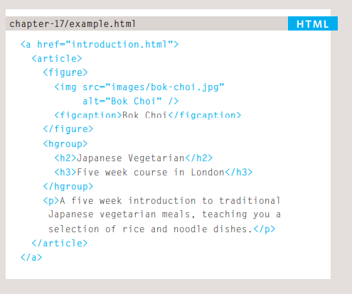

* Helping Older Browsers Understand:

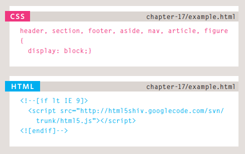

## ***Extra Markup***

*DOCTYPES:*  Because there have been several versions of HTML, each web page should begin with a DOCTYPE declaration to tell a browser which version of HTML the page is using
<!-- -->
If you want to add a comment to your code that will not be visible in the user's browser, you
can add the text between these characters:
<!-- comment goes here -->

 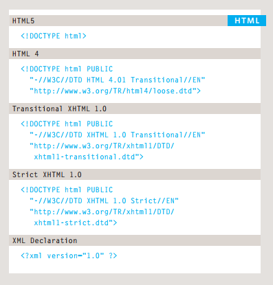

 *ID ATTRIBUTE:* Every HTML element can carry the ID attribute. It is used to uniquely identify that element from other elements on the page. Its value should start with a letter or an underscore (not a number or any other character).

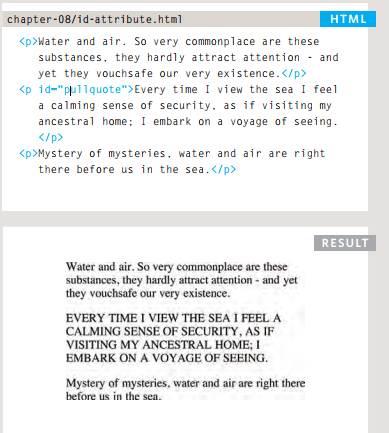

*CLASS ATTRIBUTE:* Every HTML element can also carry a class attribute.
Sometimes, rather than uniquely identifying one element within a document, you will want a
way to identify several elements as being different from the other elements on the page.

 
*BLOCK ELEMENTS:* Some elements will always appear to start on a new line in the browser window. These are known as block level elements.

*INLINE ELEMENT:* Some elements will always appear to continue on the same line as their neighboring elements. These are known as inline elements.

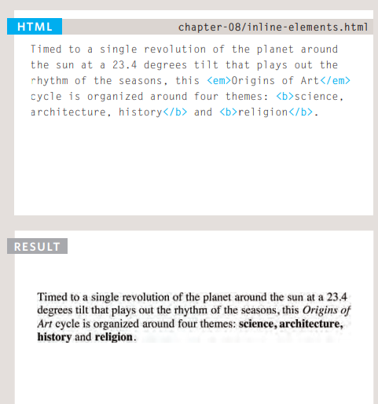

*GROUPING TEXT & ELEMENTS IN A BLOCK:* The element allows you to group a set of elements together in one block-level box. For example, you might create an element to contain all of the elements for the header of your site (the logo and the navigation), or you might create an element to contain comments from visitors.

*GROUPING TEXT & ELEMENTS INLINE:* It is used to either: 
1. Contain a section of text where there is no other suitable element to differentiate it from its surrounding text 
1. Contain a number of inline elements.
The most common reason why people use elements is so that they can control the appearance of the content of these elements using CSS.

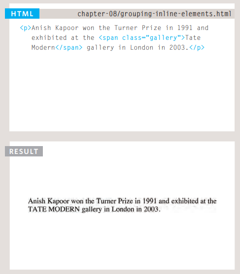

*IFRAMES:* An iframe is like a little window that has been cut into your page — and in that window you can see another page. The term iframe is an abbreviation of inline frame.

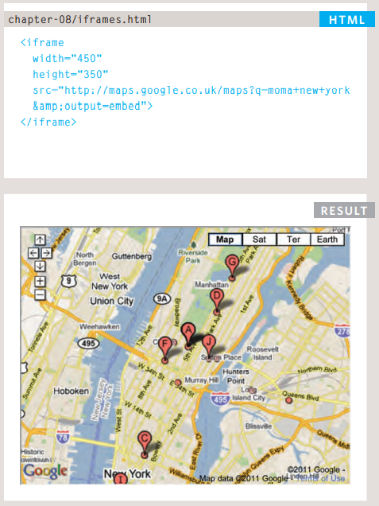

