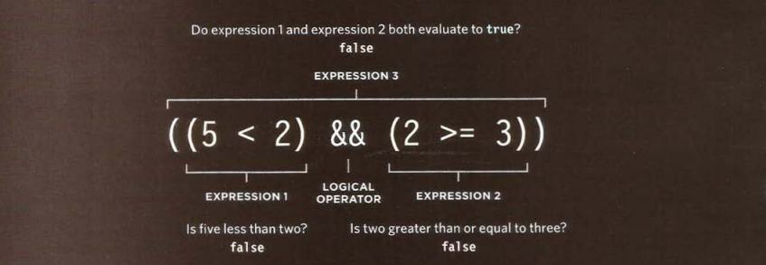

# ***Operators and Loops***
 ## _You can evaluate a situation by comparing one value in the script to what you expect it might be The result will be a Boolean true or false._

 - `==`  *IS EQUAL TO*: This operator compares two values (numbers, strings, or Booleans) to see if they are the same.
 Example: `'Tamara'== 'Tamara'` returns True.
 - `!=` *IS NOT EQUAL TO*: This operator compares two values (numbers, strings, or Booleans) to see if they are not the same.
 Example:`'Tamara'!= 'Hanadii'` returns True.
 - `===` *STRICT EQUAL TO*:This operator compares two values to check that Both the data type and value are the same.
Example:`'7'!= 7` returns False.
-  `!==` *STRICT NOT EQUAL TO*:This operator compares two values to check that Both the data type and value are not the same.
Example:`'7'!= 7` returns True.
- ` >` *GREATER THAN*: This operator checks if the number on the left is greater than the number on the right.
Example:`4 > 3 ` returns True.
- ` <` *LESS THAN*: This operator checks if the number on the left is less than the number on the right.
Example:`4 < 3 ` returns False.
- ` >=` *GREATER THAN OR EQUAL*: This operator checks if the number on the left is greater than or equal to the number on the right.
Example:`4 >= 4 ` returns True.
- ` <` *LESS THAN OR EQUAL*: This operator checks if the number on the left is less than or equal to the number on the right.
Example:`4 <= 4 ` returns True.
 

## ***LOGICAL OPERATORS***

*Comparison operators usually return single values of true or false.  Logical operators allow you to compare the results of more than one comparison operator.*

- ` &&` *LOGICAL AND*: If both expressions evaluate to true then the expression returns true.  If just one of these returns false, then the expression will return false.
Example: `4<=4 && 4>3 ` returns True.
-  ` ||` *LOGICAL OR*: If either expression evaluates to true, then the expression returns true.  If both return false, then the expression will return false .
Example: `4<=4 || 4>3 ` returns True.
- `!`*LOGICAL NOT*: This operator takes a single Boolean value and inverts it.
Example: `!(2<4) ` returns False. 

## ***LOOPS***
*Loops check a condition.  If it returns true, a code block will run.  Then the condition will be checked again and if it still returns true, the code block will run again.  It repeats until the condition returns false.*

- `For`: If you need to run code a specific number of times, use a for loop.  (It is the most common loop.) In a for loop, the condition is usually a counter which is used to tell how many times the loop should run.
- `While`: If you do not know how many times the code should run, you can use a  while loop.  Here the condition can be something other than a counter, and the code will continue to loop for as long as the condition is true.
- `Do while`: The do while is very similar to the while loop, but has one key difference: it  will always run the statements inside the curly braces at least once, even if the condition evaluates to false. 

## LOOP COUNTERS

1. INITIALIZATION Create a variable and set it to 0.  This variable is commonly called 1, and it acts as the counter.  
`var i = 0;`
1. CONDITION The loop should continue to run until the counter reaches a specified number.
`i < 10;`
1. UPDATE Every time the loop has run the statements in the curly braces, it adds one to the counter.
`i++;`

### ***Looping:***

The variable i can be used inside the loop.  Here it is used to write a number to the page.  When the statements have finished, the variable i is incremented by 1.  When the condition is no longer true the loop ends.  The script moves to the next line of code.

### ***Using while loops:***

[Back to homepage](./mainpage.md)

