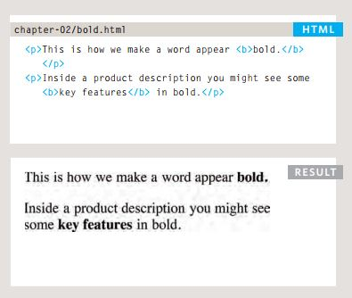
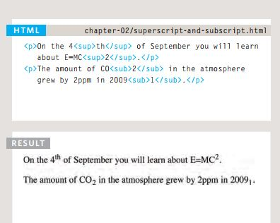
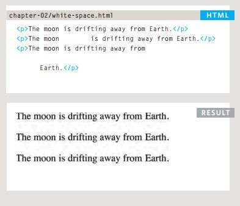
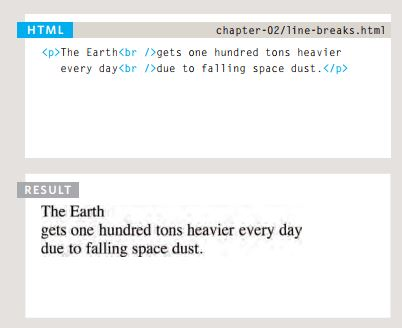

# **HTML Text, CSS Introduction, and Basic JavaScript Instructions.**
 

## *When creating a web page, you add tags (known as markup) to the contents of the page. These tags provide extra meaning and allow browsers to show users the appropriate structure for the page.*
1. *Structural markup:*
- Headings: Browsers display the contents of headings at different sizes. Th contents of an `<h1>` element is the largest, and the contents of an `<h6>` element is the smallest.

- Paragraphs: By default, a browser will show each paragraph on a new line with some space between it and
any subsequent paragraphs.

- Bold & Italic: By enclosing words in the tags `<b>` and `</b> `we can make characters appear bold, and by enclosing words in the tags <i> and </i> we can make characters appear italic.

- Superscript ans subscribt: The `` element is used
to contain characters that should be superscript such as the suffixes of dates or mathematical concepts . 
The `` element is used to contain characters that should
be subscript, it is commonly used with foot notes or chemical
formulas.

- White space: When the browser comes across
two or more spaces next to each other, it only displays one space. Similarly if it comes across a line break, it treats that as a single space too. This is known as white space collapsing.
 

 - Line breakscand horizontal rules: The browser will automatically show each new paragraph or heading on a new line. But if you wanted to add a line break inside the middle of a paragraph you can use the line break tag 
 ` `.
 

