# *HTML Lists, Control Flow with JS, and the CSS Box Model*

## *HTML Lists:*
*We have three types of lists:*
1. **Ordered lists** are lists where each item in the list is
numbered. 
1. **Unordered lists** are lists that begin with a bullet point.
1. **Definition lists** are made up of a set of terms along with the definitions for each of those terms.
<br>

### **Ordered lists**:
 The ordered list is created with the ``<ol>`` element, ach item in the list is placed between an opening ```<li>``` tag and a closing ```</li>``` tag.
<br>

### *e.g:*
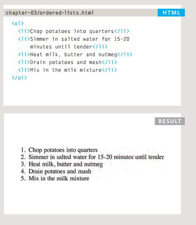
<br>

### **Unordered lists**:
 The unordered list is created with the ``<ul>`` element, Each item in the list is placed between an opening ``<li> ``tag and a closing ``</li>`` tag.
<br>

### *e.g:*
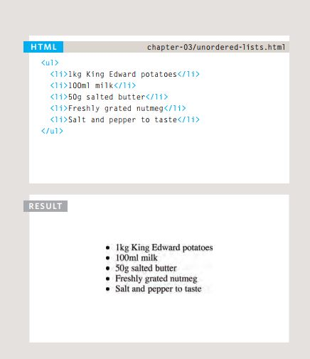
<br>

### **Definition lists**:
The definition list is created with the ``<dl>`` element and usually consists of a series of terms and their definitions,inside the ``<dl>`` element you will usually see pairs of ``<dt>`` and ``<dd>`` elements.

<br>

### *e.g:*
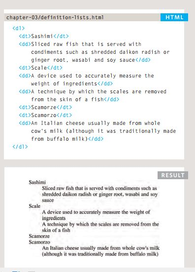
<br>

## **Nested lists**:
You can put a second list inside an ``<li>`` element to create a sublist or nested list. Browsers display nested lists
indented further than the parent list. In nested unordered lists, the browser will usually change the style of the bullet point too.
<br>

### *e.g:*
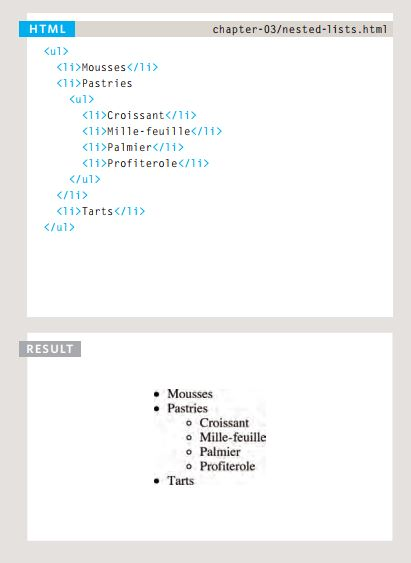
<br>

## *CSS Boxes:*

### **Box Dimensions: width, height:**
- The most popular ways to
specify the size of a box are
to use pixels, percentages, or
ems. Traditionally, pixels have
been the most popular method
because they allow designers to
accurately control their size.

### *e.g:*
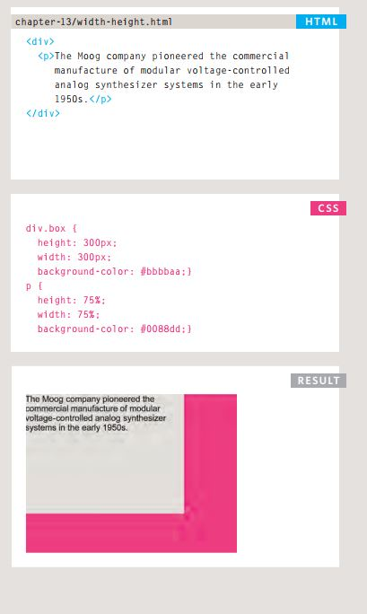
<br>

### **Limiting Width:**
- min-width, max-width :
<br>

### *e.g:*
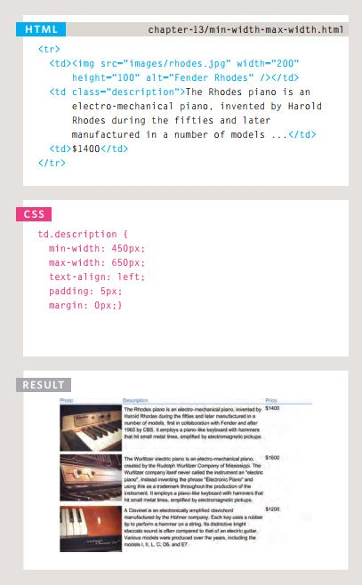
<br>

- min-height, max-height:
<br>

### *e.g:*
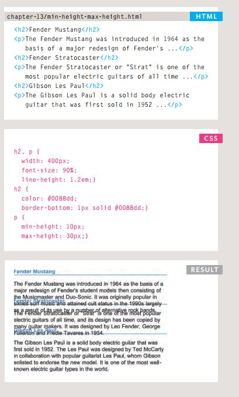
<br>

### **Overflowing Content:**
- The overflow property tells the
browser what to do if the content
contained within a box is larger
than the box itself.

<br>

### *e.g:*
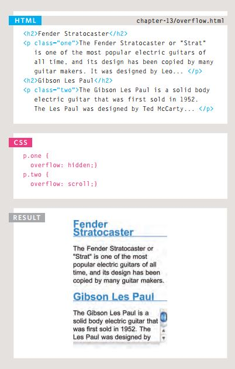
<br>


### **Borders:**
- Border Width:
<br>

### *e.g:*
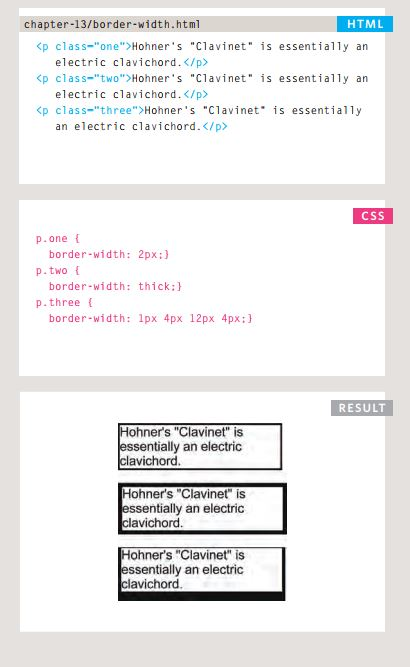
<br>

- Border Style:
<br>

### *e.g:*
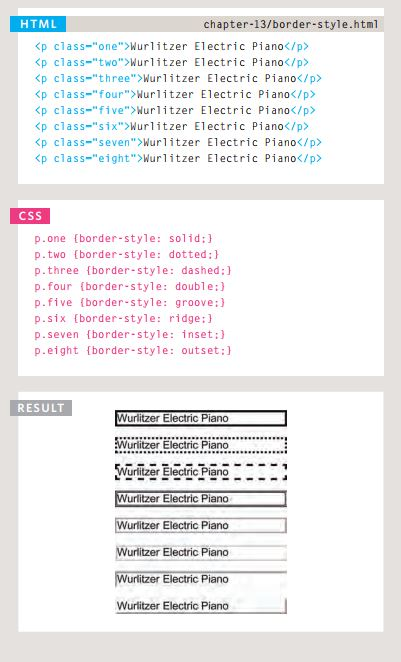
<br>


- Border Color:
<br>

### *e.g:*
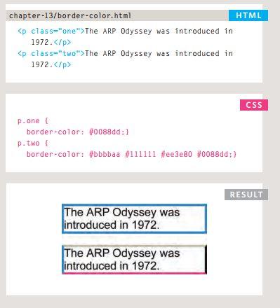
<br>

- Shorthand Border:
<br>

### *e.g:*
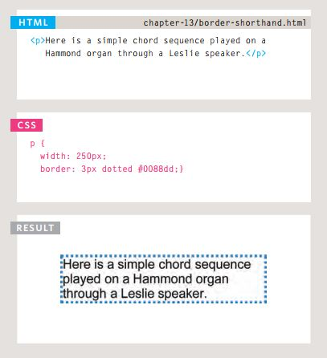
<br>

- Padding:
The padding property allows
you to specify how much space
should appear between the
content of an element and its
border.
<br>

 ### *e.g:*
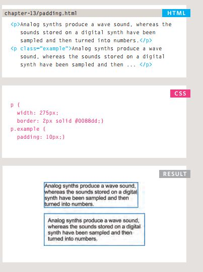
<br>

- Margin:

<br>

 ### *e.g:*
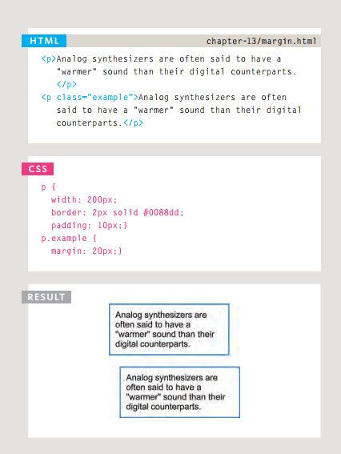
<br>

- Centering Content: 

<br>

 ### *e.g:*
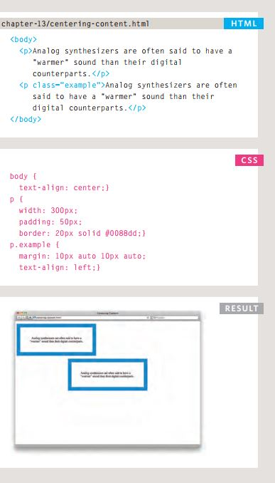
<br>

- Change Inline/Block:

<br>

 ### *e.g:*
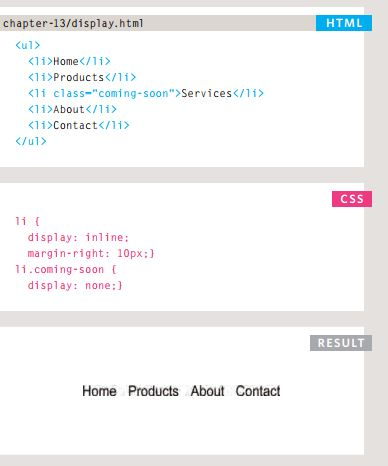
<br>

- Hiding Boxes:

<br>

 ### *e.g:*
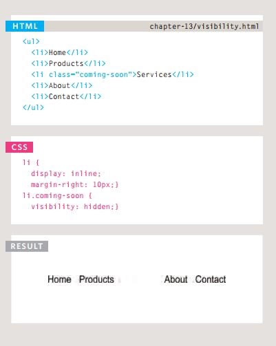
<br>

- CSS3 Border Images:
 
 <br>

 ### *e.g:*

<br>


- Rounded Corners:


 <br>

 ### *e.g:*
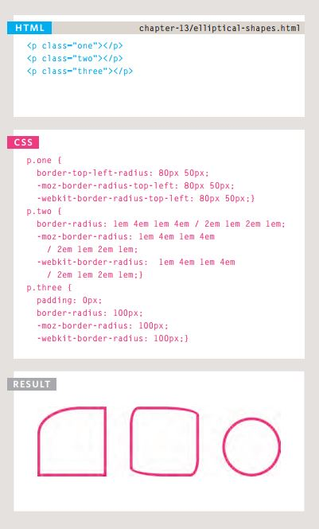
<br>

- Rounded Corners:


 <br>

 ### *e.g:*

<br>

## *Arrays in javascript:*

- An array is a special type of variable. It doesn't
just store one value; it stores a list of values.

 <br>

 ### *e.g:*
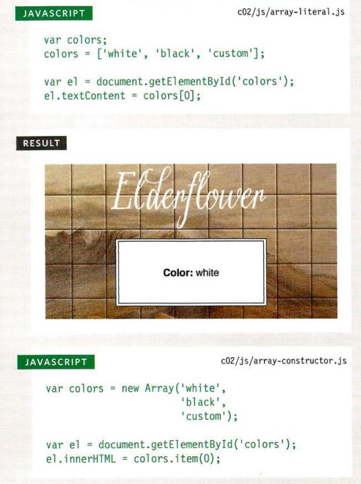
<br>


- ACCESSING & CHANGING VALUES IN AN ARRAY:

 <br>

 ### *e.g:*

<br>

- USING IF... ELSE STATEMENTS:

<br>

 ### *e.g:*
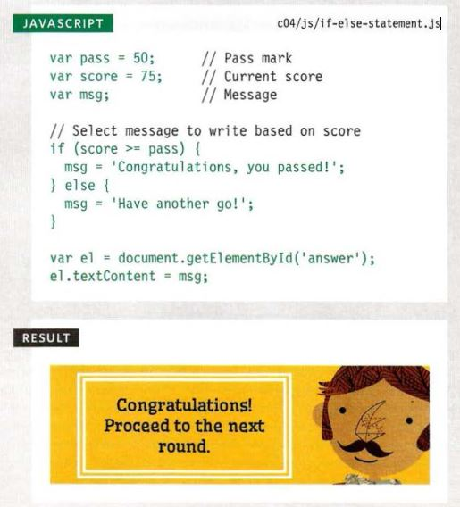
<br>


- SWITCH STATEMENTS: 
A switch statement starts with a
variable called the switch value.
Each case indicates a possible
value for this variable and the
code that should run if the
variable matches that value.

<br>

 ### *e.g:*
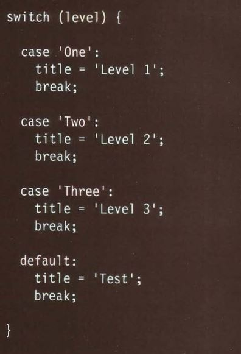
<br>

- USING SWITCH STATEMENTS:

 <br>

 ### *e.g:*
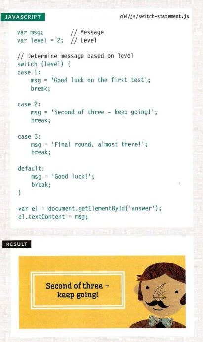
<br>

## *Looping:**

- USING FOR LOOPS:

<br>

 ### *e.g:*

<br>

- USING WHILE LOOPS:

<br>

 ### *e.g:*
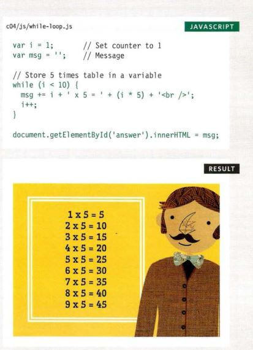
<br>

- USING DO WHILE LOOPS:

<br>

 ### *e.g:*
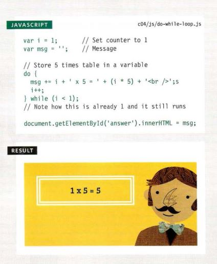
<br>

[Back to homepage](./readme.md)


