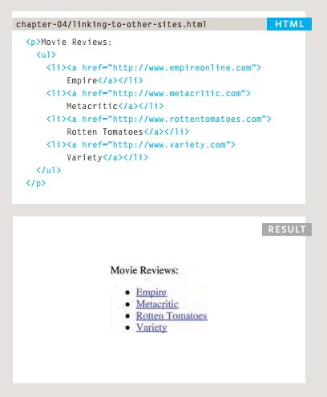
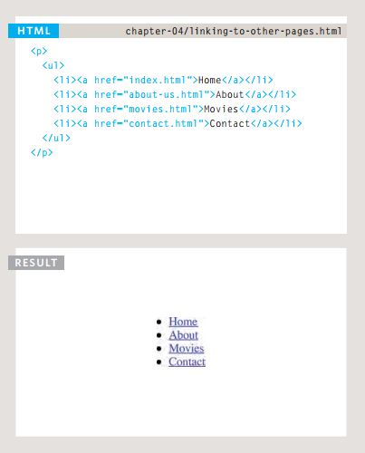
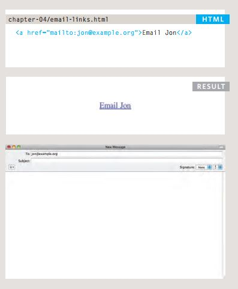
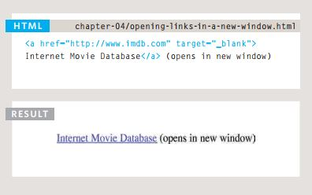
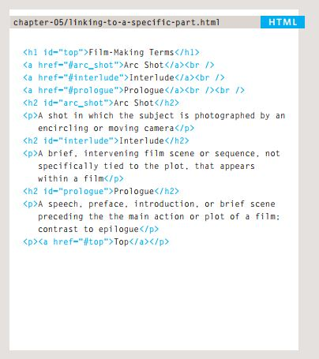
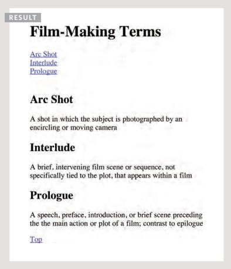
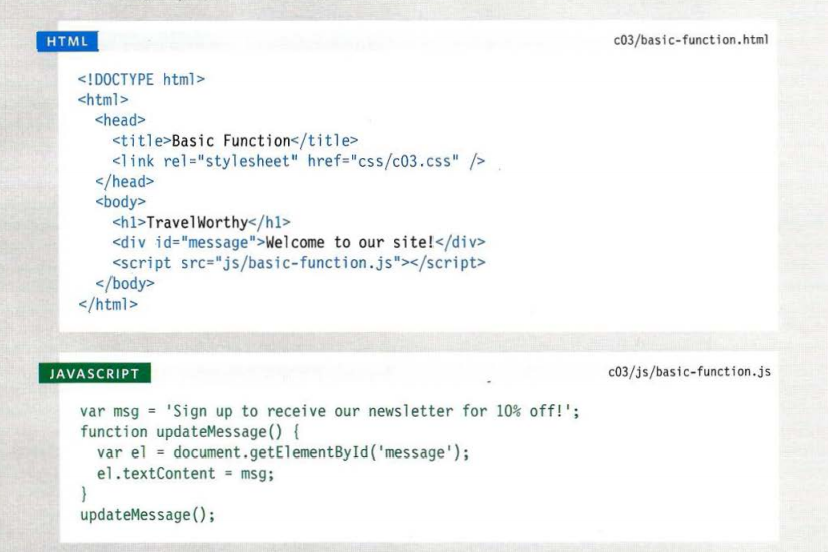
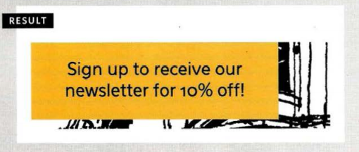
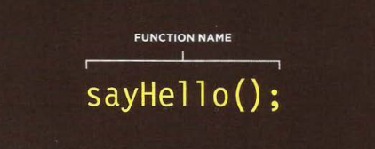

# *HTML Links, JS Functions, and Intro to CSS Layout*

## *HTML Links*

- Writing links: We can write links using many ways like:
1. Linking to other sites:<br>
 Links are created using the ``<a>``
element which has an attribute
called href. The value of the
href attribute is the page that
you want people to go to when
they click on the link.<br>
e.g:<br>



<br>
1. Linking to other Pages
on the same site:<br>
When you are linking to other
pages within the same site,
you do not need to specify the
domain name in the URL. You
can use a shorthand known as a
relative URL.<br>
e.g:<br>



<br>

1. Email Links:<br>
To create a link that starts up
the user's email program and
addresses an email to a specified
email address, you use the ``<a>``
element. However, this time the
value of the href attribute starts
with mailto: and is followed by
the email address you want the
email to be sent to.<br>
*e.g :*<br>
<br>



<br>


1. oPening Links in
A neW WinDoW:<br>
If you want a link to open in a
new window, you can use the
target attribute on the opening
``<a>`` tag. The value of this
attribute should be`` _blank``.<br>
*e.g :*<br>
<br>



<br>

1. Linking to A sPeciFic
PArt oF the sAme PAge:<br>
Before you can link to a specific
part of a page, you need to
identify the points in the page
that the link will go to. You do
this using the id attribute (which
can be used on every HTML
element). You can see that the
``<h1>`` and ``<h2>`` elements in this
example have been given id
attributes that identify those
sections of the page.<br>
*e.g :*<br>
<br>



<br>
<br>




1. Linking to A sPeciFic
PArt oF Another PAge:<br>
If you want to link to a specific
part of a different page (whether
on your own site or a different
website) you can use a similar
technique.<br>


## *CSS Layout:*

- Key ConCepts in
positioning eLements:<br>
Building Blocks
CSS treats each HTML element as if it is in its
own box. This box will either be a block-level
box or an inline box.
Block-level boxes start on a new line and act as the main building blocks
of any layout, while inline boxes flow between surrounding text. You can
control how much space each box takes up by setting the width of the
boxes (and sometimes the height, too). To separate boxes, you can use
borders, margins, padding, and background colors.<br>
Block-level elements:<br>
start on a new line
Examples include:
``<h1>`` ``<p>`` ``<ul>`` ``<li>`` <br>

Inline elementsflow in Between
surrounding text
Examples include:
```` ``<b>`` ``<i>`` <br>

- containing ElEmEnts:<br>
If one block-level element sits inside another
block-level element then the outer box is
known as the containing or parent element.
It is common to group a number of elements together inside a ``<div>``
(or other block-level) element. For example, you might group together
all of the elements that form the header of a site (such as the logo and
the main navigation). The ``<div>`` element that contains this group of
elements is then referred to as the containing element.<br>

- ControLLing the
position of eLements:<br>
CSS has the following positioning schemes that allow you to control
the layout of a page:<br>
1. Normal flow :<br>
Every block-level element
appears on a new line, causing
each item to appear lower down
the page than the previous one. see <cite>HTML CSS BOOK P.365
1. Relative Positioning:<br>
This moves an element from the
position it would be in normal
flow, shifting it to the top, right,
bottom, or left of where it
would have been placed.See <cite>HTML CSS BOOK P.366 .
1. Absolute Positioning:<br>
This positions the element
in relation to its containing
element.It is taken out of
normal flow, meaning that it
does not affect the position
of any surrounding elements.See <cite>HTML CSS BOOK P.367 .

To indicate where a box should be positioned, you may also need to use
box offset properties to tell the browser how far from the top or bottom
and left or right it should be placed.<br>
 - Fixed Positioning:<br>
 Elements with fixed positioning
do not affect the position of
surrounding elements and they
do not move when the user
scrolls up or down the page.<cite>HTML CSS BOOK P.368 .<br>
Floating Elements:<br>
Floating an element allows
you to take that element out
of normal flow and position
it to the far left or right of a
containing box.<cite>HTML CSS BOOK P.367-376 .


## *JS Functions:*

## _Functions let you group a series of statements together to perform a specific task. If different parts of a script repeat the same task, you can reuse the function (rather than repeating the same set of statements)._


## ***BASIC FUNCTION:***

*In this example, the user is shown a message at the top of the pa/ge. The message is held in an HTML element whose id attribute has a value of message. The message is going to be changed using JavaScript.
Before the closing  ``</body> `` tag , you can see the link to the JavaScript file. The JavaScript file starts with a variable used to hold a new message, and is followed by a function called updateMessage().*
<br>


<br>
 
 


## ***DECLARING A FUNCTION***

*To run the code in the function, you use the function name followed by parentheses.  In programmer - speak, you would say that this code calls a function.  You can call the same function as many times as you want within the same JavaScript file.*
<br>



<br>


### ***DECLARING FUNCTIONS THAT NEED INFORMATION ***
 *Sometimes a function needs specific information to perform its task.  In such cases, when you declare the function you give it parameters.  Inside the function, the parameters act like variables.*

 *If a function needs information to work, you indicate what it needs to know in parentheses after the function name.  The items that appear inside these parentheses are known as the parameters of the function.  Inside the function those words act like variable names.*

 ## ***CALLING A FUNCTION***
*Having declared the function, you can then execute all of the statements between its curly braces with just one line of code.  This is known as calling the function.*


### ***CALLING FUNCTIONS THAT NEED INFORMATION ***
*When you call a function that has parameters, you specify the values it should use in the parentheses that follow its name.  The values are called arguments, and they can be provided as values or as variables.*

### ***GETTING A SINGLE VALUE OUT OF A FUNCTION ***

*Some functions return information to the code that called them.  For example, when they perform a calculation, they return the result.*

### ***GETTING MULTIPLE VALUES OUT OF A FUNCTION***

*Functions can return more than one value using an array.  For example, this function calculates the area and volume of a box.*
<br>

# *6 Reasons for Pair Programming:*

While there are many different styles, pair programming commonly involves two roles: the Driver and the Navigator. The Driver is the programmer who is typing and the only one whose hands are on the keyboard. Handling the “mechanics” of coding, the Driver manages the text editor, switching files, version control, and—of course writing—code. The Navigator uses their words to guide the Driver but does not provide any direct input to the computer. The Navigator thinks about the big picture, what comes next, how an algorithm might be converted in to code, while scanning for typos or bugs. The Navigator might also utilize their computer as a second screen to look up solutions and documentation, but should not be writing any code.

1. Greater efficiency.
1. Engaged collaboration.
1. Learning from fellow students.
1. Social skills.
1. Job interview readiness.
1. Work environment readiness.

<br>

[Back to homepage](./readme.md)


