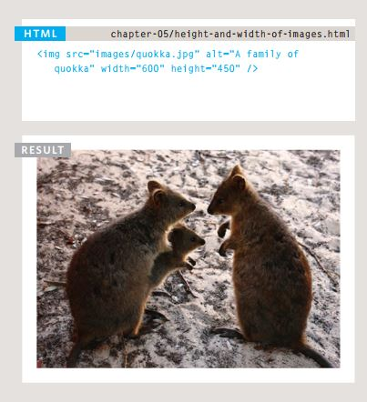
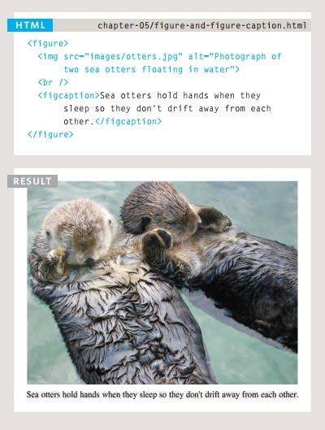
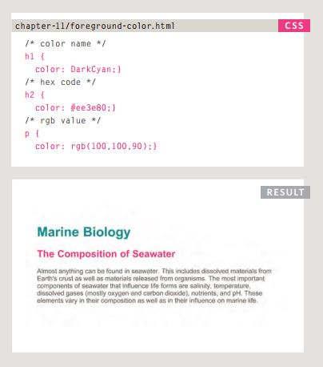
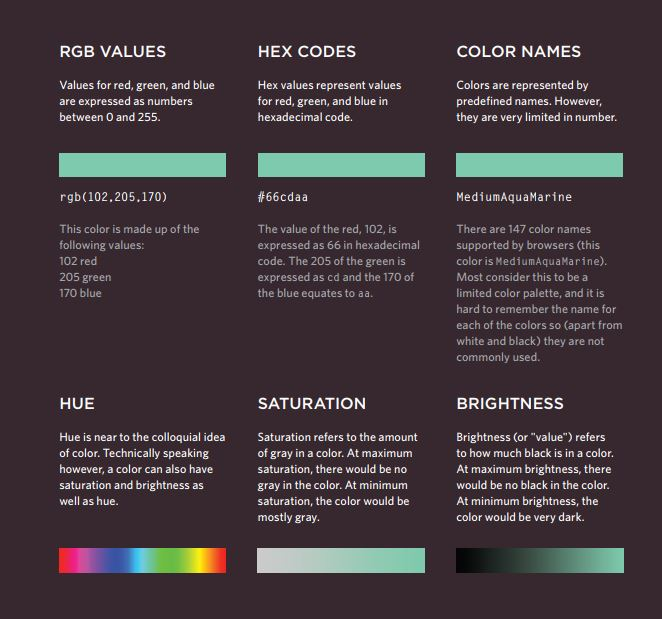
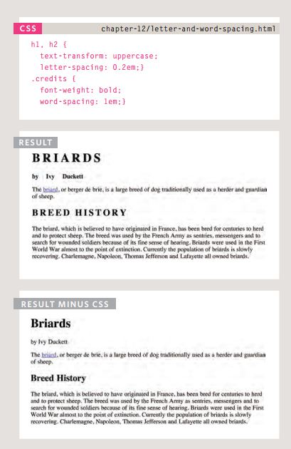
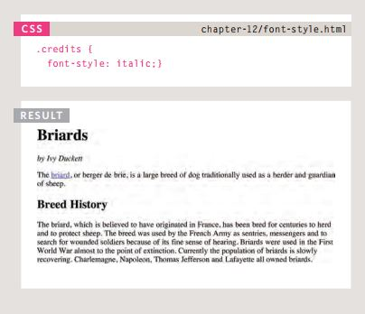

# Images, Color,and Text.

## Images:
- Adding Images: <br>
To add an image into the page
you need to use an ````
element. This is an empty
element (which means there is
no closing tag). It must carry the
following two attributes: *src*, *alt*, *title* . <br>
Example:<br>


- Height & Width
of images: <br>
You will also often see an ````
element use two other attributes
that specify its size: *height*, *width*.<br>
Example:<br>




- Where to place Images
In Your Code: 
 1. Before a paragraph
The paragraph starts on a new
line after the image.
1. Inside the start of a
paragraph
The first row of text aligns with
the bottom of the image.
3. In the middle of a
paragraph
The image is placed between the
words of the paragraph that it
appears in.


- Images format: 
  - JPEG: Whenever you have many different
colors in a picture you should use a JPEG.
A photograph that features snow or an
overcast sky might look like it has large
areas that are just white or gray, but the
picture is usually made up of many different
colors that are subtly different.
  - GIF: Use GIF or PNG format
when saving images
with few colors or large
areas of the same color.

-  HTML5: figure and
figure Caption: <br>




# Color:
Foreground Color:<br>
- The color property allows you
to specify the color of text inside
an element. You can specify any
color in CSS in one of three ways: *RGB values*, *HEX codes*, *color names*.<br>
Example: <br>


- background-color:<br>
Example: <br>


## Understanding color:<br>
Every color on a computer screen is created by mixing amounts of red,
green, and blue. To find the color you want, you can use a color picker.<br>




# Text:
You can specify typfaces  by : *font-family*, *font-size*, *font-weight*, *font-style*, *text-transform*, *text decoration*, *line-height*, and many other properities, here some of them as examples: <br>

 <br>
 <br>


[Back to homepage](./readme.md)