# Problem Domain, Objects, and the DOM.

## Problem Domain:
 Understanding The Problem Domain Is The Hardest Part Of Programming:

Programming is easy if you understand the problem domain,
Most of the work at the time was basic waterfall development. 
you can do one of two things:

1. Make the problem domain easier.
1. Get better at understanding the problem domain.

- take a part of the problem and fully understand that part before expanding the problem domain.

## Object Literals:
Objects group together a set of variables and functions to create a model
of a something you would recognize from the real world. In an object,
variables and functions take on new names.

*CREATING·OBJECTS USING
LITERAL NOTATION*

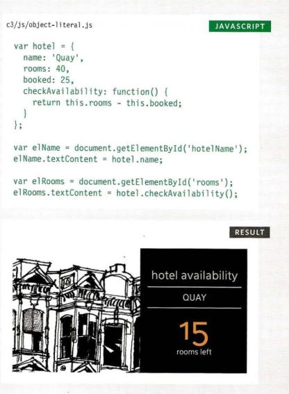

## The DOM:
The Document Object Model (DOM) specifies
how browsers should create a model of an HTML
page and how JavaScript can access and update the
contents of a web page while it is in the browser window. 
- MAKING A MODEL OF THE
HTML PAGE 
When the browser loads a web page, it
creates a model of the page in memory.
- ACCESSING AND CHANG ING
THE HTML PAGE: 
The DOM also defines methods and
properties to access and update each
object in this model, which in turn updates
what the user sees in the browser.

-THE DOM TREE IS A
MODEL OF A WEB PAGE: 
As a browser loads a web page, it creates a model of that page.
The model is called a DOM tree, and it is stored in the browsers' memory.
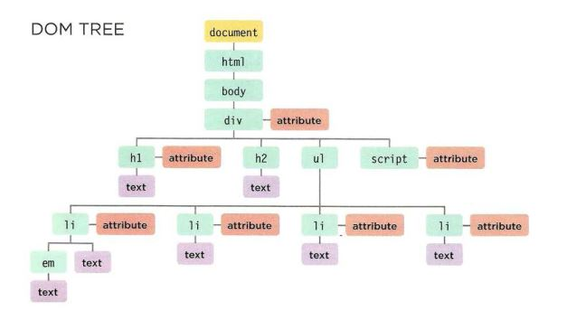  

It consists of four main types of nodes:
1. THE DOCUMENT NODE:When you access any element, attribute, or text
node, you navigate to it via the document node. It is
the starting point for all visits to the DOM tree.
1. ELEMENT NODES:
HTML elements describe the structure of an HTML
page. (The ``<hl > - <h6>`` elements describe what
parts are headings; the`` 
 ``tags indicate where
paragraphs of text start and finish; and so on.)

***Each node is an object with methods and properties.
Scripts access and update this DOM tree (not the source HTML file).
Any changes made to the DOM tree are reflected in the browser.***
1. ATTRIBUTE NODES:
The opening tags of HTML elements can carry
attributes and these are represented by attribute
nodes in the DOM tree.
1. TEXT NODES:
Once you have accessed an element node, you
can then reach the text within that element. This is
stored in its own text node.

**WORKING WITH
THE DOM TREE:** 
Accessing and updating the DOM tree involves two steps:
1. Locate the node that represents the element you want to work with.
1. Use its text content, child elements, and attributes.

*SELECTING ELEMENTS
USING ID ATTRIBUTES:*
get El ementByi d() allows you
to select a single element node
by specifying the value of its
id attribute. 
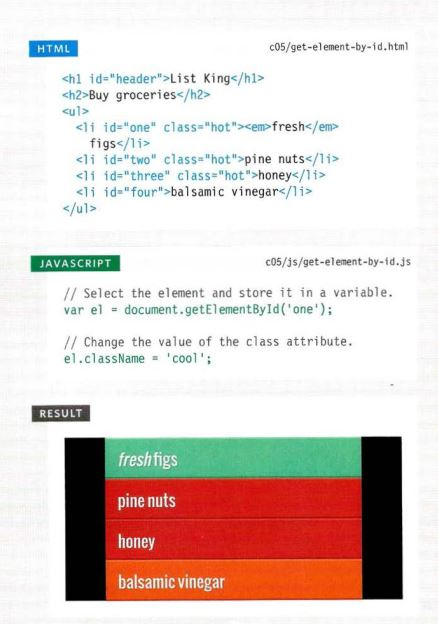  

*SELECTING AN ELEMENT
FROM A NODELIST*
- THE item()METHOD: 
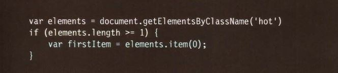  

- ARRAY SYNTAX:
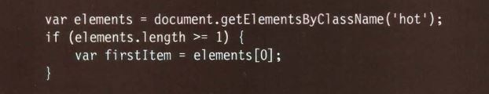  

[Back to homepage](./readme.md)

*SELECTING ELEMENTS
USING CLASS ATTRIBUTES:*
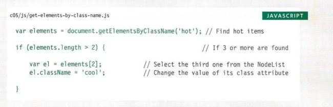  
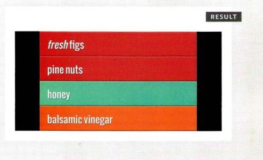  

*SELECTING ELEMENTS
BY TAG NAME:*
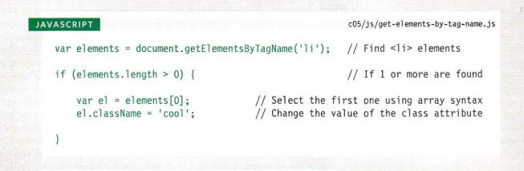  
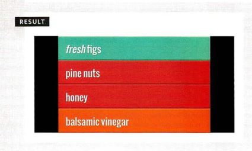  

*SELECTING ELEMENTS
USING CSS SELECTORS:*
  
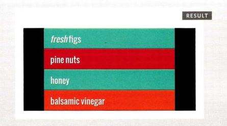  

*LOOPING THROUGH
A NODELIST:*
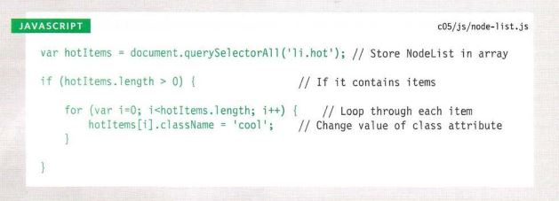  
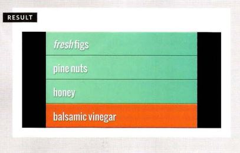  

*LOOPING THROUGH
A NODELIST:play-by-play*
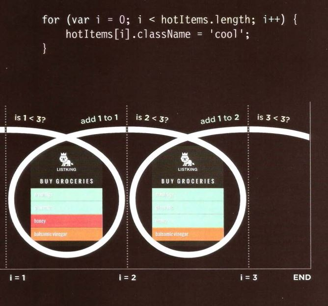  

*TRAVERSING THE DOM:*
When you have an element node, you can select
another element in relation to it using these five
properties. This is known as traversing the DOM.
 parentNode, previousSibling
nextSibling, firstChild and
lastChild.

*WHITESPACE NODES:* Traversing the DOM can be difficult because
some browsers add a text node whenever they
come across whitespace between elements.

*ACCESS & UPDATE A TEXT
NODE WITH NODEVALUE*
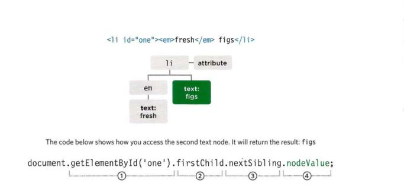  

*ACCESSING & CHANGING
A TEXT NODE*
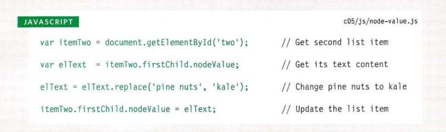  
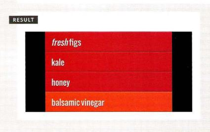  

*ACCESSING TEXT ONLY*
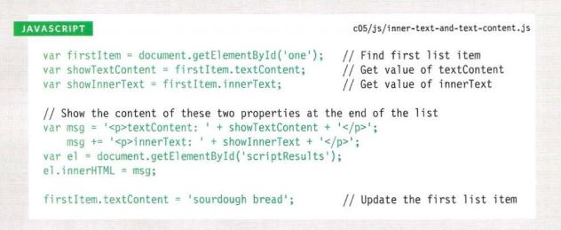  
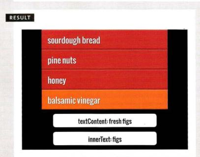  

*UPDATE TEXT & MARKUP:*

*ADDING AN ELEMENT TO
THE DOM TREE*
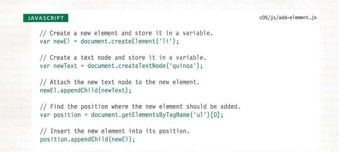  
  

*REMOVING AN ELEMENT
FROM THE DOM TREE*
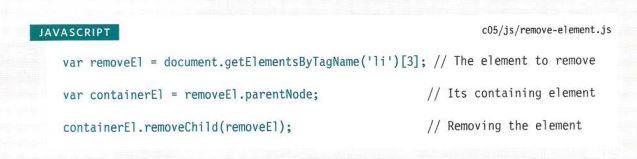  
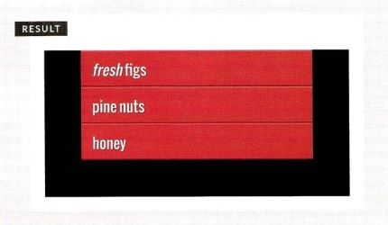  

**ATTRIBUTE NODES**
*CHECK FOR AN ATTRIBUTE
AND GET ITS VALUES*
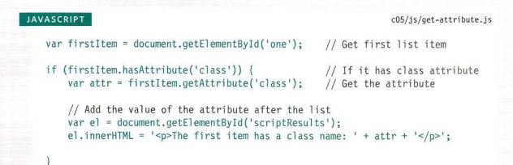  
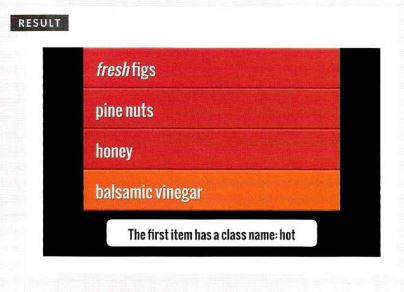  

*CREATING ATTRIBUTES &
CHANGING THEIR VALUES*
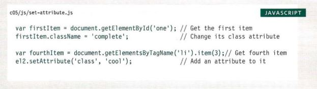  
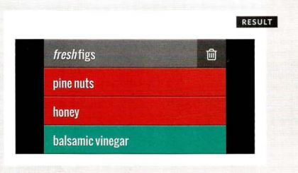  

*REMOVING ATTRIBUTES*
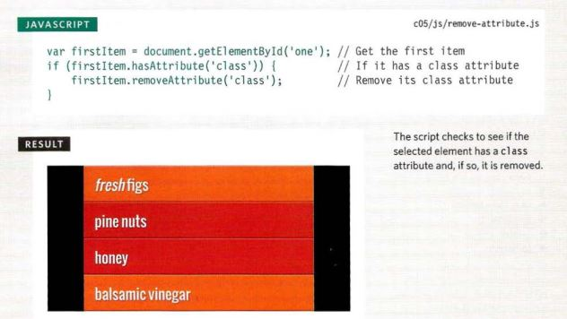  

[Back to homepage](./readme)