# *Object-Oriented Programming, HTML Tables.*


## *Domain Modeling:*
Domain modeling is the process of creating a conceptual model in code for a specific problem. A model describes the various entities, their attributes and behaviors, as well as the constraints that govern the problem domain. An entity that stores data in properties and encapsulates behaviors in methods is commonly referred to as an object-oriented model.<br>

Model epic fails videos:
Define a constructor and initialize properties
Here's an implementation of the `EpicFailVideo` constructor function.<br>
```var EpicFailVideo = function(epicRating, hasAnimals) {
  this.epicRating = epicRating;
  this.hasAnimals = hasAnimals;
}

var parkourFail = new EpicFailVideo(7, false);
var corgiFail = new EpicFailVideo(4, true);

console.log(parkourFail);
console.log(corgiFail); 
```
<br>


***Summary***<br>
Domain modeling is the process of creating a conceptual model for a specific problem. And a domain model that's articulated well can verify and validate your understanding of that problem.<br>

Here's some tips to follow when building your own domain models.<br>

When modeling a single entity that'll have many instances, build self-contained objects with the same attributes and behaviors.
Model its attributes with a constructor function that defines and initializes properties.
Model its behaviors with small methods that focus on doing one job well.<br>
Create instances using the new keyword followed by a call to a constructor function.<br>
Store the newly created object in a variable so you can access its properties and methods from outside.
Use the this variable within methods so you can access the object's properties and methods from inside.<br>

## *HTML Tables*

*Basic Table structure:* 
<br>

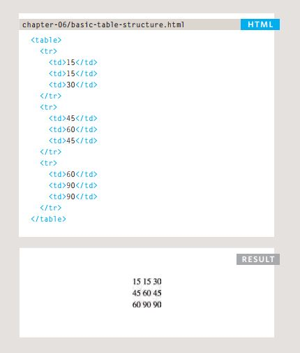
<br>

*Table headings*
<br>

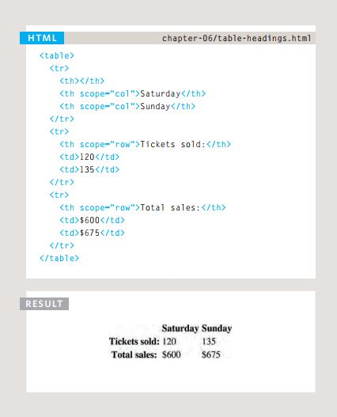
<br>

*spanning columns*
<br>

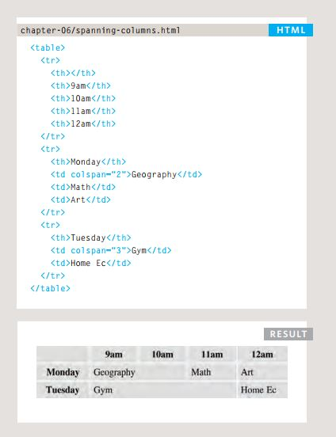
<br>

*spanning rows*
<br>

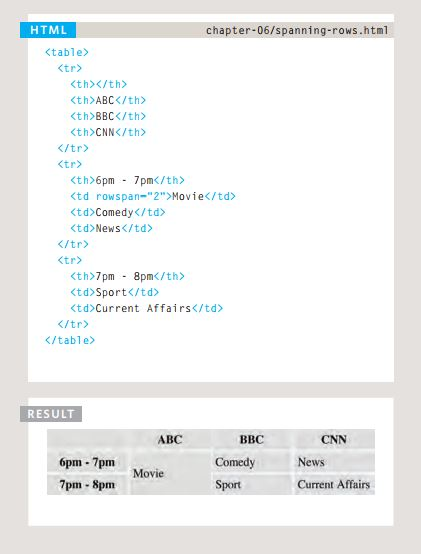
<br>

*Long Tables*
<br>

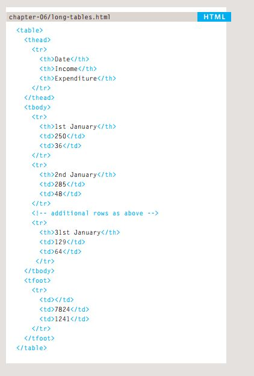
<br>

<br>


<br>

*Width & spacing*
<br>

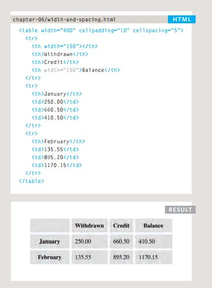
<br>


## *Object-Oriented Programming*

 *Creating an object :*<br>
 *Constructor notation:*
 <br>

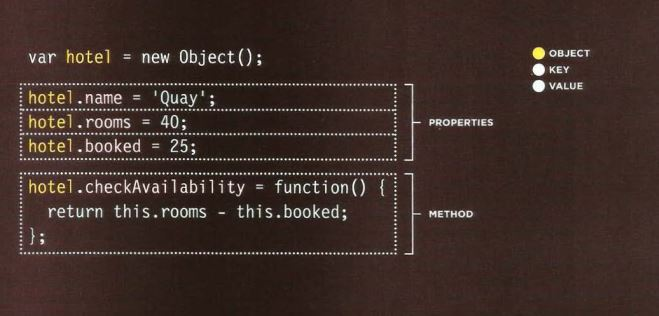
<br>

*Updating an Object:*

 <br>

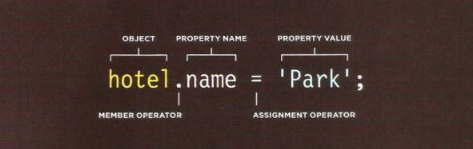
<br>

*Creating Many objects :<br>
 Constructor notation:*
 <br>

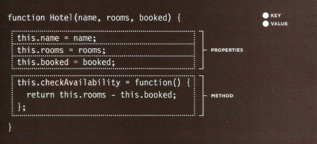
<br>


*CREATING OBJECTS USING
CONSTRUCTOR SYNTAX:*

 <br>

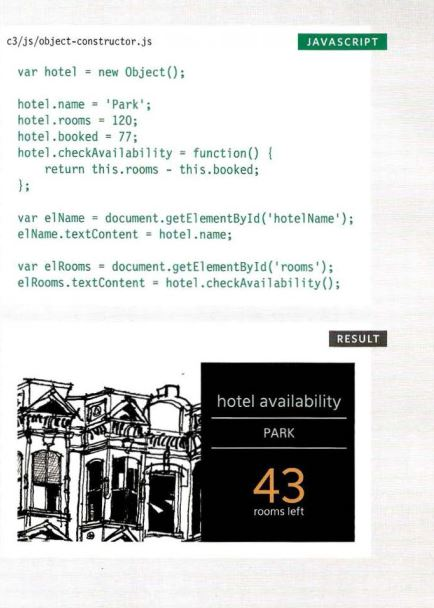
<br>

*ADDING AND REMOVING
PROPERTIES:*
 <br>

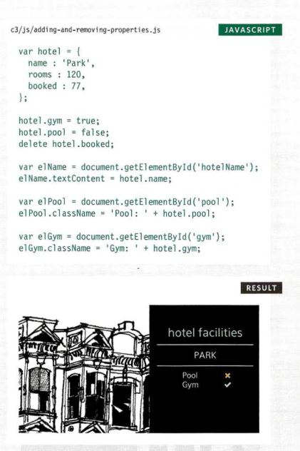
<br>


*Arrays are objects:*

<br>


<br>
 

 [Back to homepage](./home/tamara/Reading-notes/README)