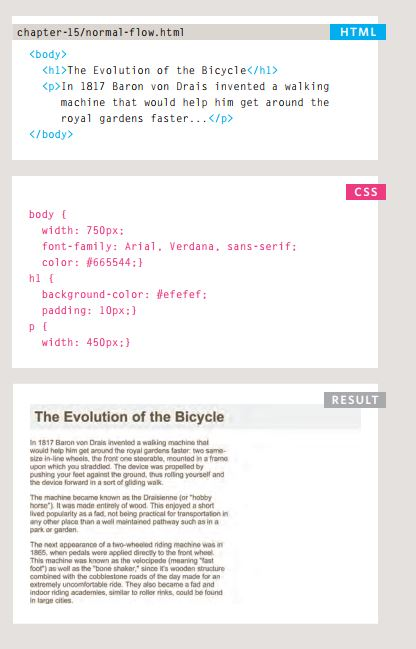
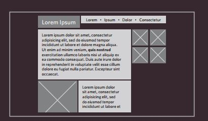
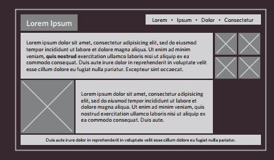

# *CSS Layout:*

- Key ConCepts in
positioning eLements:<br>
Building Blocks
CSS treats each HTML element as if it is in its
own box. This box will either be a block-level
box or an inline box.
Block-level boxes start on a new line and act as the main building blocks
of any layout, while inline boxes flow between surrounding text. You can
control how much space each box takes up by setting the width of the
boxes (and sometimes the height, too). To separate boxes, you can use
borders, margins, padding, and background colors.<br>
Block-level elements:<br>
start on a new line
Examples include:
``<h1>`` ``<p>`` ``<ul>`` ``<li>`` <br>

Inline elementsflow in Between
surrounding text
Examples include:
```` ``<b>`` ``<i>`` <br>

- containing ElEmEnts:<br>
If one block-level element sits inside another
block-level element then the outer box is
known as the containing or parent element.
It is common to group a number of elements together inside a ``<div>``
(or other block-level) element. For example, you might group together
all of the elements that form the header of a site (such as the logo and
the main navigation). The ``<div>`` element that contains this group of
elements is then referred to as the containing element.<br>

- ControLLing the
position of eLements:<br>
CSS has the following positioning schemes that allow you to control
the layout of a page:<br>
1. Normal flow :<br>
Every block-level element
appears on a new line, causing
each item to appear lower down
the page than the previous one. see <cite>HTML CSS BOOK P.365

<br>


<br>


1. Relative Positioning:<br>
This moves an element from the
position it would be in normal
flow, shifting it to the top, right,
bottom, or left of where it
would have been placed.

1. Absolute Positioning:<br>
This positions the element
in relation to its containing
element.It is taken out of
normal flow, meaning that it
does not affect the position
of any surrounding elements.See <cite>HTML CSS BOOK P.367 .

To indicate where a box should be positioned, you may also need to use
box offset properties to tell the browser how far from the top or bottom
and left or right it should be placed.<br>
 - Fixed Positioning:<br>
 Elements with fixed positioning
do not affect the position of
surrounding elements and they
do not move when the user
scrolls up or down the page.<cite>HTML CSS BOOK P.368 .<br>
Floating Elements:<br>
Floating an element allows
you to take that element out
of normal flow and position
it to the far left or right of a
containing box.<cite>HTML CSS BOOK P.367-376 .


## *Sceen sizes*:

Different visitors to your site will have different sized screens that show
different amounts of information, so your design needs to be able to
work on a range of different sized screens.<br>


## *Screen resoLution*
Resolution refers to the number of dots a screen shows per inch. Some
devices have a higher resolution than desktop computers and most
operating systems allow users to adjust the resolution of their screens.


## *Page sizes*
Because screen sizes and display resolutions vary so much, web
designers often try to create pages of around 960-1000 pixels wide
(since most users will be able to see designs this wide on their screens).


## *Fixed width Layouts*

<br>





<br>


## *Liquid Layouts*


<br>





<br>


 [Back to homepage](./home/tamara/Reading-notes/README)