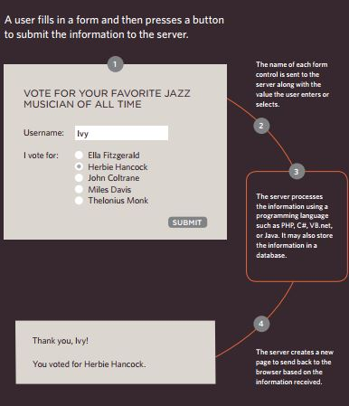
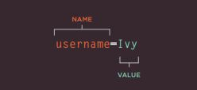
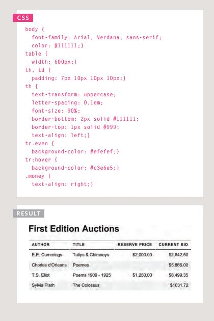
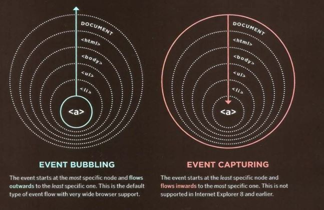

# *Forms and JS Events*

## *Forms*

*Why Forms?*
The best known form on the web is probably
the search box that sits right in the middle of
Google's homepage. 

*HoW Forms Work*:
 

 

*form may have several form controls, each
gathering different information. The server
needs to know which piece of inputted data
corresponds with which form element.*

 

 
*To differentiate between various pieces of inputted data, information
is sent from the browser to the server using name/value pairs. In this
example, the form asks for the visitor's username and also for their
favorite jazz musician. The name/value pairs sent to the server are*

 

 

## *Lists, Tables & Forms*

- Bullet Ponits Style:

 

 

- Table Properties:

 

 

- Event Flow:

 

 

 [Back to homepage](./home/tamara/Reading-notes/code201/README)