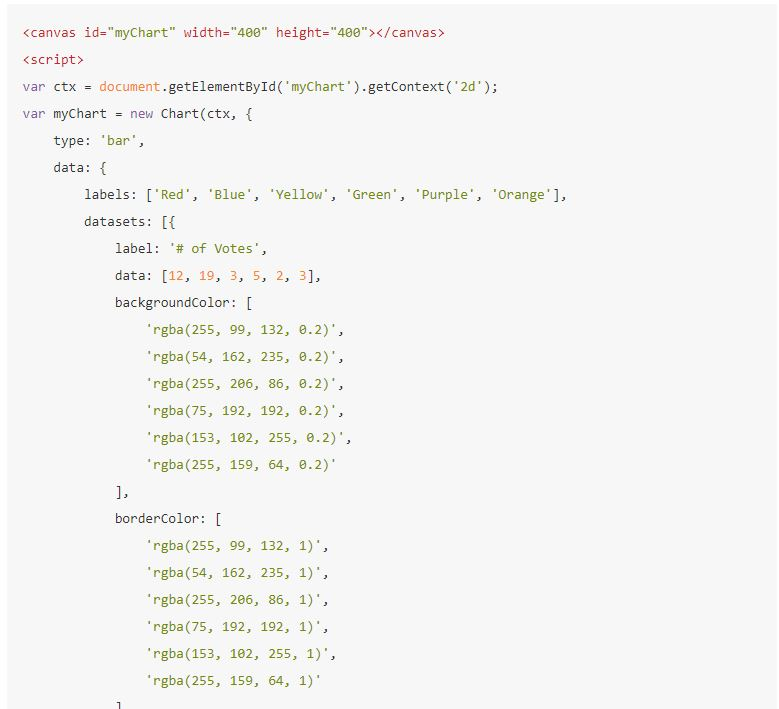
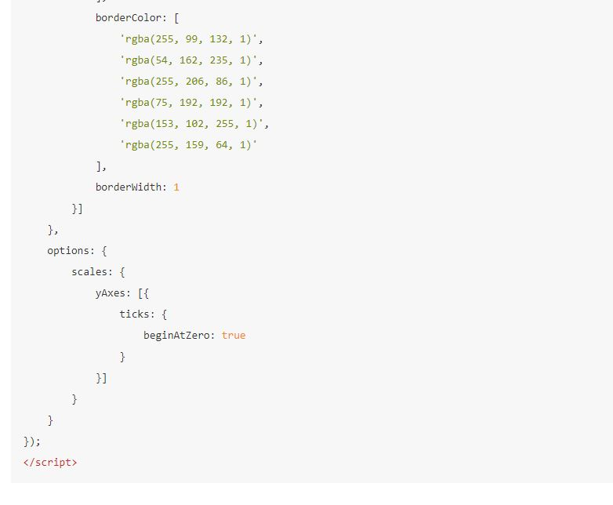
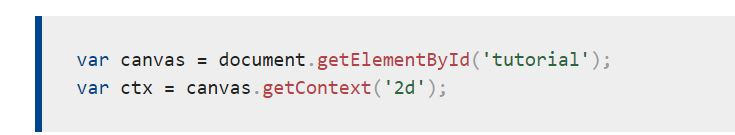
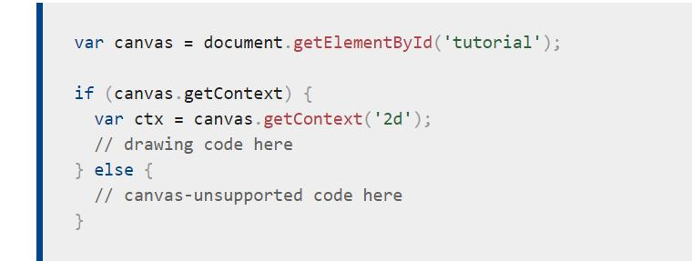
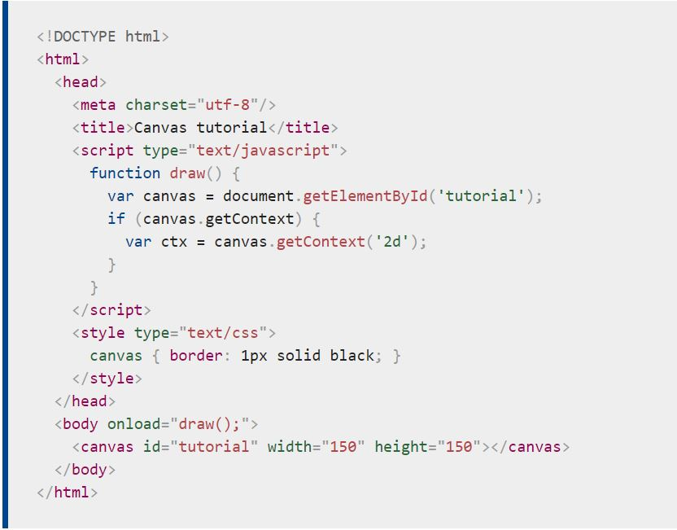
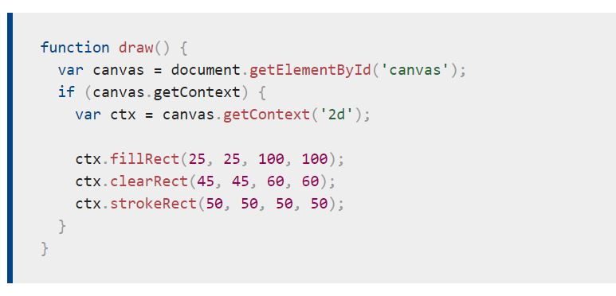
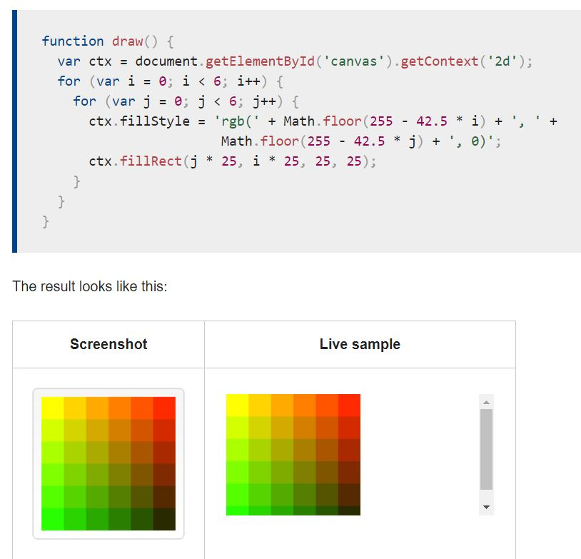
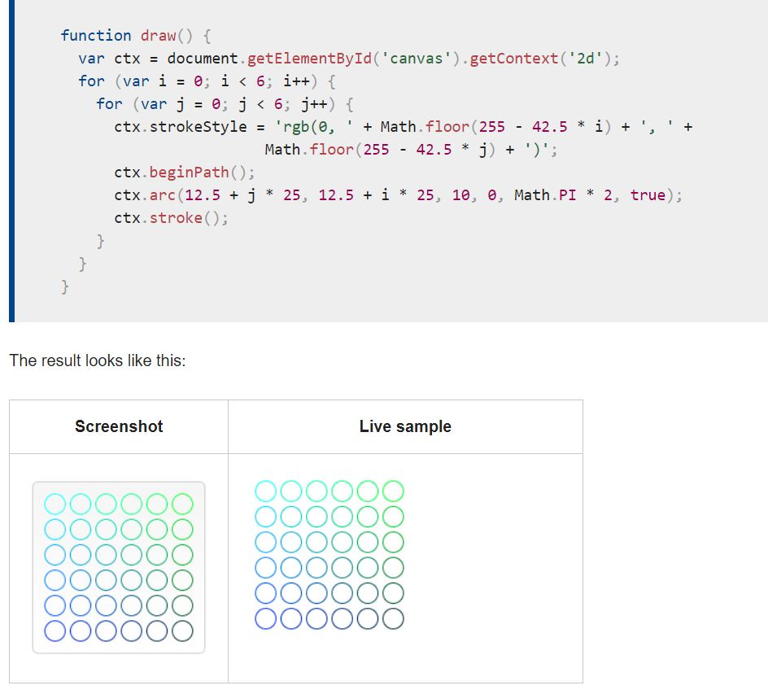
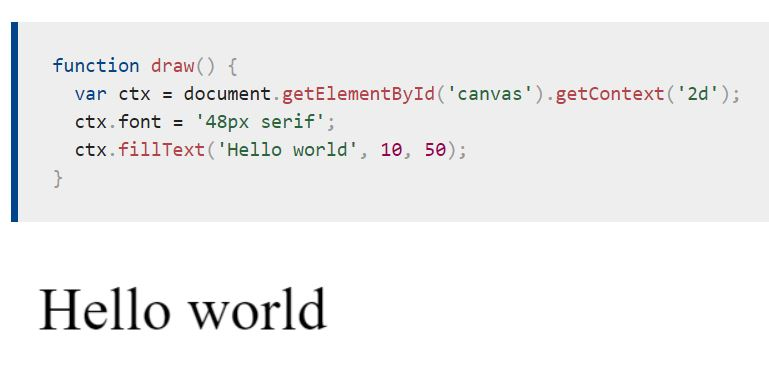
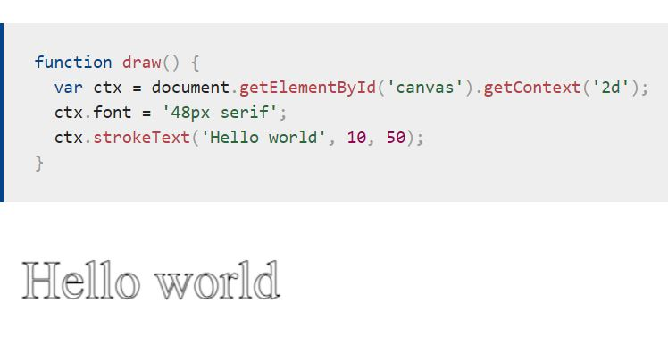

# *Chart.js, Canvas*

##  Chart.js :

- **Creating a Chart:**
It's easy to get started with Chart.js. All that's required is the script included in your page along with a single `<canvas>` node to render the chart.


<br>



<br>


- **The `<canvas>` element:**


<br>


<br>


-**Fallback content:**
The `<canvas>` element differs from an `` tag in that, like for`<video>`, `<audio>`, or `<picture>` elements, it is easy to define some fallback content, to be displayed in older browsers not supporting it, like versions of Internet Explorer earlier than version 9 or textual browsers. You should always provide fallback content to be displayed by those browsers. <br>

Providing fallback content is very straightforward: just insert the alternate content inside the `<canvas>` element. Browsers that don't support `<canvas>` will ignore the container and render the fallback content inside it. Browsers that do suppo. <br>

  - Required `</canvas>`tag
As a consequence of the way fallback is provided, unlike the `` element, the `<canvas>` element requires the closing tag (`</canvas>`). If this tag is not present, the rest of the document would be considered the fallback content and wouldn't be displayed. <br>

If fallback content is not needed, a simple ``<canvas id="foo" ...></canvas>`` is fully compatible with all browsers that support canvas at all. <br>

- **The rendering context**  <br>
The canvas is initially blank. To display something, a script first needs to access the rendering context and draw on it. The `<canvas>` element has a method called getContext(), used to obtain the rendering context and its drawing functions. getContext() takes one parameter, the type of context. For 2D graphics, such as those covered by this tutorial, you specify "2d" to get a CanvasRenderingContext2D.

<br>


<br>


- **Checking for support** <br>
The fallback content is displayed in browsers which do not support `<canvas>`. Scripts can also check for support programmatically by testing for the presence of the ```getContext()``` method.

<br>


<br>


- **A skeleton template**
The script includes a function called ```draw()```, which is executed once the page finishes loading; this is done by listening for the ``load`` event on the document. This function, or one like it, could also be called using ```window.setTimeout()```, ```window.setInterval()```, or any other event handler, as long as the page has been loaded first.

<br>


<br>

## Drawing shapes with canvas:
 - **The Grid**
 Before we can start drawing, we need to talk about the canvas grid or coordinate space. Our HTML skeleton from the previous page had a canvas element 150 pixels wide and 150 pixels high. To the right, you see this canvas with the default grid overlayed. Normally 1 unit in the grid corresponds to 1 pixel on the canvas. The origin of this grid is positioned in the top left corner at coordinate (0,0). All elements are placed relative to this origin. So the position of the top left corner of the blue square becomes x pixels from the left and y pixels from the top, at coordinate (x,y). Later in this tutorial we'll see how we can translate the origin to a different position, rotate the grid and even scale it, but for now we'll stick to the default.


 - Drawing rectangles
Unlike SVG, `<canvas>`only supports two primitive shapes: rectangles and paths (lists of points connected by lines). All other shapes must be created by combining one or more paths. Luckily, we have an assortment of path drawing functions which make it possible to compose very complex shapes.

First let's look at the rectangle. There are three functions that draw rectangles on the canvas:

```fillRect(x, y, width, height)
Draws a filled rectangle.
strokeRect(x, y, width, height)
Draws a rectangular outline.
clearRect(x, y, width, height)
Clears the specified rectangular area, making it fully transparent.
```
<br>
Example: 
 <br>


<br>


### Applying styles and colors:
 - **Colors**
 If we want to apply colors to a shape, there are two important properties we can use: fillStyle and strokeStyle.

``fillStyle = color``
Sets the style used when filling shapes.
``strokeStyle = color``
Sets the style for shapes' outlines.
<br>
 - A fillStyle example:
  <br>


<br>

 - A strokeStyle example:
  <br>


<br>


## Drawing text:
The canvas rendering context provides two methods to render text:

`fillText(text, x, y [, maxWidth])`
Fills a given text at the given (x,y) position. Optionally with a maximum width to draw. <br>
`strokeText(text, x, y [, maxWidth])`
Strokes a given text at the given (x,y) `position. Optionally with a maximum width to draw.

 - A fillText example:
  <br>


<br>


 - A strokeText example:
  <br>


<br>


- **Styling Text**

`font = value`<br>
The current text style being used when drawing text. This string uses the same syntax as the CSS font property. The default font is 10px sans-serif. <br>
`textAlign = value` <br>
Text alignment setting. Possible values: start, end, left, right or center. The default value is start. <br>
`textBaseline = value` <br>
Baseline alignment setting. Possible values: top, hanging, middle, alphabetic, ideographic, bottom. The default value is alphabetic. <br>
`direction = value` <br>
Directionality. Possible values: `ltr`, `rtl`, `inherit`. The default value is `inherit`. <br>


[Back to homepage](./main/README.md)
