# *CSS Transforms, Transitions, and Animations*


### **Transforms**
Now general layout techniques can be revisited with alternative ways to size, position, and change elements. All of these new techniques are made possible by the `transform `property.
<br>
The `transform `property comes in two different settings, two-dimensional and three-dimensional. Each of these come with their own individual properties and values.
<br>

Transform Syntax:

```div {
  -webkit-transform: scale(1.5);
     -moz-transform: scale(1.5);
       -o-transform: scale(1.5);
          transform: scale(1.5);
}
```
<br>

**2D Transforms** 
<br>
Elements may be distorted, or transformed, on both a two-dimensional plane or a three-dimensional plane. Two-dimensional transforms work on the x and y axes, known as horizontal and vertical axes. Three-dimensional transforms work on both the x and y axes, as well as the z axis. These three-dimensional transforms help define not only the length and width of an element, but also the depth. We’ll start by discussing how to transform elements on a two-dimensional plane, and then work our way into three-dimensional transforms.
<br>

**2D Rotate** <br>
The transform property accepts a handful of different values. The rotate value provides the ability to rotate an element from 0 to 360 degrees. Using a positive value will rotate an element clockwise, and using a negative value will rotate the element counterclockwise. The default point of rotation is the center of the element, 50% 50%, both horizontally and vertically. Later we will discuss how you can change this default point of rotation.


<br>

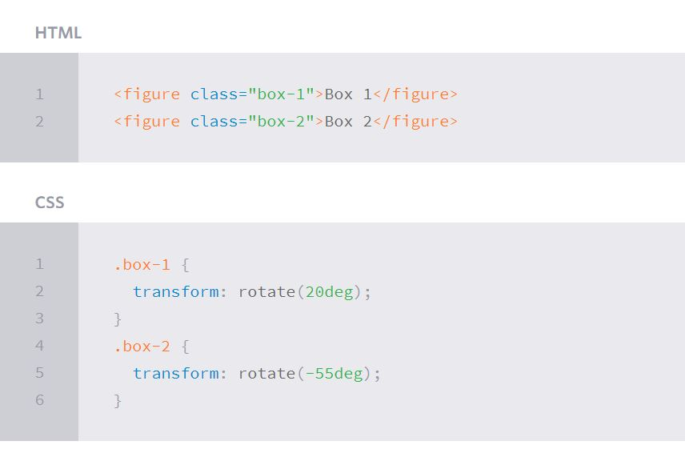
<br>


**2D Scale**  <br>
Using the scale value within the transform property allows you to change the appeared size of an element. The default scale value is 1, therefore any value between .99 and .01 makes an element appear smaller while any value greater than or equal to 1.01 makes an element appear larger.

<br>

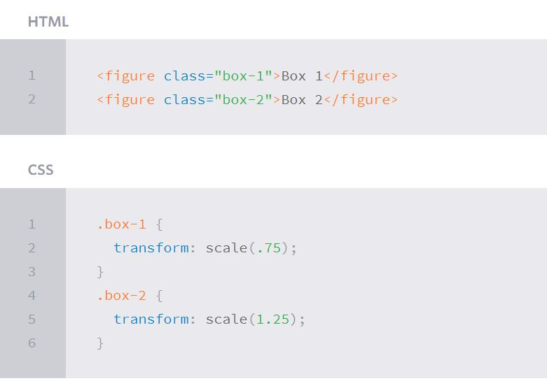
<br>


**2D Translate**  <br>
The translate value works a bit like that of relative positioning, pushing and pulling an element in different directions without interrupting the normal flow of the document. Using the translateX value will change the position of an element on the horizontal axis while using the translateY value will change the position of an element on the vertical axis.

As with the scale value, to set both the x and y axis values at once, use the translate value and declare the x axis value first, followed by a comma, and then the y axis value.

The distance values used within the translate value may be any general length measurement, most commonly pixels or percentages. Positive values will push an element down and to the right of its default position while negative values will pull an element up and to the left of its default position.


<br>

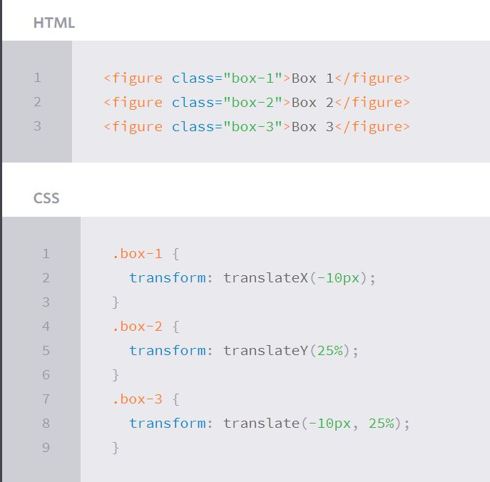
<br>


**2D Skew** 
The last transform value in the group, skew, is used to distort elements on the horizontal axis, vertical axis, or both. The syntax is very similar to that of the scale and translate values. Using the skewX value distorts an element on the horizontal axis while the skewY value distorts an element on the vertical axis. To distort an element on both axes the skew value is used, declaring the x axis value first, followed by a comma, and then the y axis value.%p

The distance calculation of the skew value is measured in units of degrees. Length measurements, such as pixels or percentages, do not apply here.

<br>

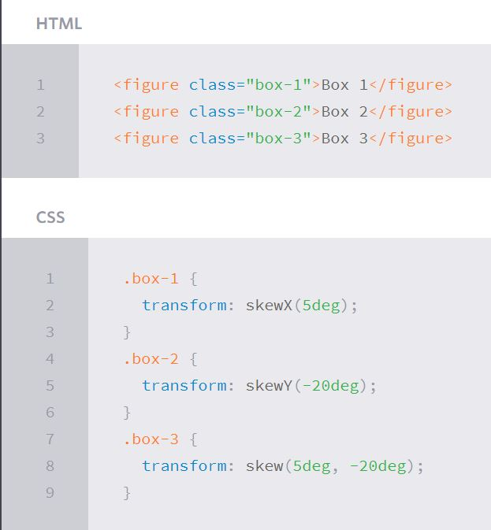
<br>

**Combining Transforms**  <br>
It is common for multiple transforms to be used at once, rotating and scaling the size of an element at the same time for example. In this event multiple transforms can be combined together. To combine transforms, list the transform values within the transform property one after the other without the use of commas.

Using multiple transform declarations will not work, as each declaration will overwrite the one above it. The behavior in that case would be the same as if you were to set the height of an element numerous times.

<br>

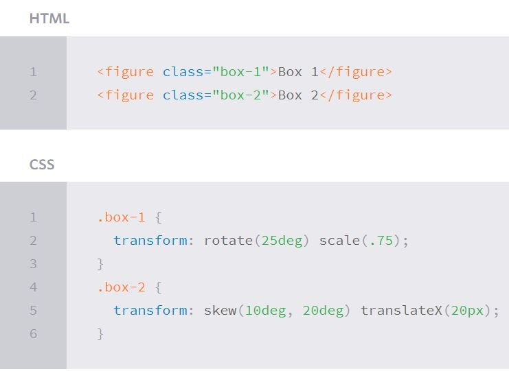
<br>

### **Transitions & Animations**

With CSS3 transitions you have the potential to alter the appearance and behavior of an element whenever a state change occurs, such as when it is hovered over, focused on, active, or targeted.
<br>
Animations within CSS3 allow the appearance and behavior of an element to be altered in multiple keyframes. Transitions provide a change from one state to another, while animations can set multiple points of transition upon different keyframes.
<br>
**Transitions** <br>
As mentioned, for a transition to take place, an element must have a change in state, and different styles must be identified for each state. The easiest way for determining styles for different states is by using the :hover, :focus, :active, and :target pseudo-classes.

There are four transition related properties in total, including transition-property, transition-duration, transition-timing-function, and transition-delay. Not all of these are required to build a transition, with the first three are the most popular.

In the example below the box will change its background color over the course of 1 second in a linear fashion.

<br>

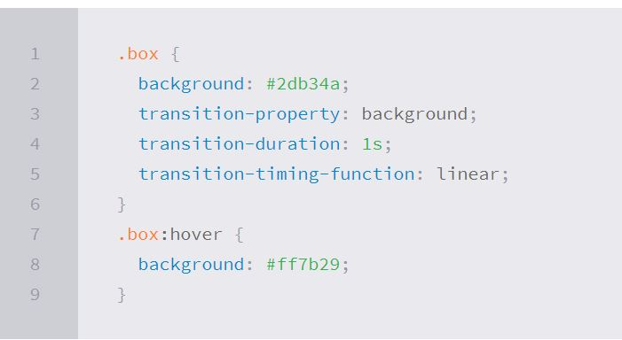
<br>


Vendor Prefixes
The code above, as with the rest of the code samples in this lesson, are not vendor prefixed. This is intentionally un-prefixed in the interest of keeping the code snippet small and comprehensible. For the best support across all browsers, use vendor prefixes.
<br> 

**Transitional Property** <br>
The transition-property property determines exactly what properties will be altered in conjunction with the other transitional properties. By default, all of the properties within an element’s different states will be altered upon change. However, only the properties identified within the transition-property value will be affected by any transitions.

In the example above, the background property is identified in the transition-property value. Here the background property is the only property that will change over the duration of 1 second in a linear fashion. Any other properties included when changing an element’s state, but not included within the transition-property value, will not receive the transition behaviors as set by the transition-duration or transition-timing-function properties.

If multiple properties need to be transitioned they may be comma separated within the transition-property value. Additionally, the keyword value all may be used to transition all properties of an element.

<br>

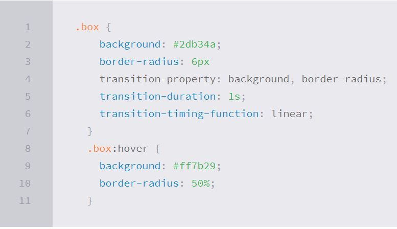
<br>


**Transitional Properties** <br>
It is important to note, not all properties may be transitioned, only properties that have an identifiable halfway point. Colors, font sizes, and the alike may be transitioned from one value to another as they have recognizable values in-between one another. The display property, for example, may not be transitioned as it does not have any midpoint. A handful of the more popular transitional properties include the following.

<br>

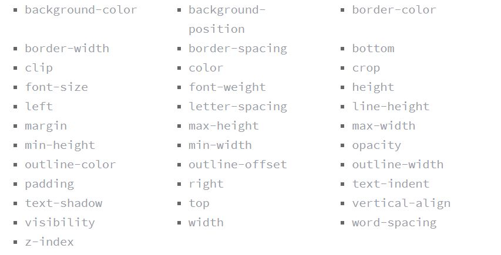
<br>

**Shorthand Transitions** <br>
Declaring every transition property individually can become quite intensive, especially with vendor prefixes. Fortunately there is a shorthand property, transition, capable of supporting all of these different properties and values. Using the transition value alone, you can set every transition value in the order of transition-property, transition-duration, transition-timing-function, and lastly transition-delay. Do not use commas with these values unless you are identifying numerous transitions.

To set numerous transitions at once, set each individual group of transition values, then use a comma to separate each additional group of transition values.


## **Animations**
Transitions do a great job of building out visual interactions from one state to another, and are perfect for these kinds of single state changes. However, when more control is required, transitions need to have multiple states. In return, this is where animations pick up where transitions leave off.

<br>

**Animations Keyframes** <br>
To set multiple points at which an element should undergo a transition, use the @keyframes rule. The @keyframes rule includes the animation name, any animation breakpoints, and the properties intended to be animated.

<br>

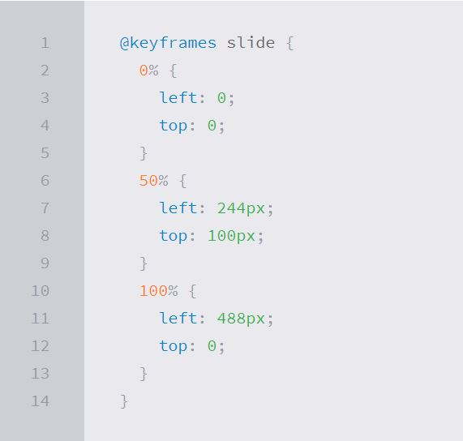
<br>

**Animation Name** <br>
Once the keyframes for an animation have been declared they need to be assigned to an element. To do so, the animation-name property is used with the animation name, identified from the @keyframes rule, as the property value. The animation-name declaration is applied to the element in which the animation is to be applied to.

<br>

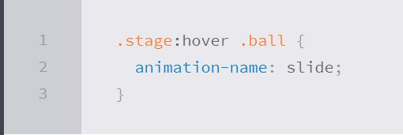
<br>


**Customizing Animations**  <br>
Animations also provide the ability to further customize an element’s behavior, including the ability to declare the number of times an animation runs, as well as the direction in which an animation completes.
<br>
Animation Iteration
By default, animations run their cycle once from beginning to end and then stop. To have an animation repeat itself numerous times the animation-iteration-count property may be used. Values for the animation-iteration-count property include either an integer or the infinite keyword. Using an integer will repeat the animation as many times as specified, while the infinite keyword will repeat the animation indefinitely in a never ending fashion.

<br>

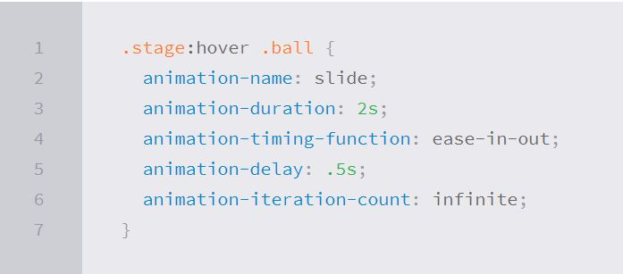
<br>


**Shorthand Animations** <br>

Fortunately animations, just like transitions, can be written out in a shorthand format. This is accomplished with one animation property, rather than multiple declarations. The order of values within the animation property should be animation-name, animation-duration, animation-timing-function, animation-delay, animation-iteration-count, animation-direction, animation-fill-mode, and lastly animation-play-state.

<br>

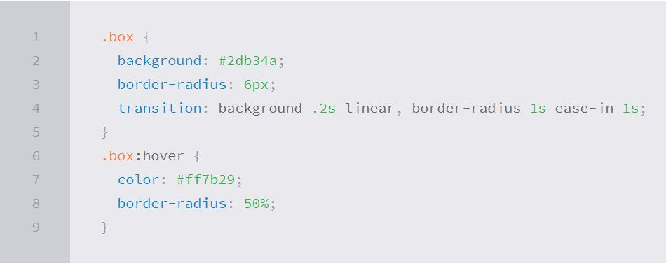
<br>


## **8 SIMPLE CSS3 TRANSITIONS THAT WILL WOW YOUR USERS**

Just a couple of lines of code will give you an awesome transition effect that will excite your users, increase engagement and ultimately, when used well, increase your conversions. What’s more, these effects are hardware accelerated, and a progressive enhancement that you can use right now.

1. Fade in: Having things fade in is a fairly common request from clients. It’s a great way to emphasize functionality or draw attention to a call to action.
1. Change color: Animating a change of color used to be unbelievably complex, with all kinds of math involved in calculating separate RGB values and then recombining them.
1. Grow & Shrink: To grow an element, you used to have to use its width and height, or its padding. But now we can use CSS3’s transform to enlarge.
1. Rotate elements:CSS transforms have a number of different uses, and one of the best is transforming the rotation of an element.
1. Square to circle: A really popular effect at the moment is transitioning a square element into a round one, and vice versa. With CSS, it’s a simple effect to achieve, we just transition the border-radius property.
1. 3D shadow:
3D shadows were frowned upon for a year or so, because they weren’t seen as compatible with flat design, which is of course nonsense, they work fantastically well to give a user feedback on their interactions and work with flat, or fake 3D interfaces.

   This effect is achieved by adding a box shadow, and then moving the element on the x axis using the transform and translate properties so that it appears to grow out of the screen.

1. Swing: Not all elements use the transition property. We can also create highly complex animations using @keyframes, animation and animation-iteration.   
 In this case, we’ll first define a CSS animation in your styles. You’ll notice that due to implementation issues, we need to use @-webkit-keyframes as well as @keyframes (yes, Internet Explorer really is better than Chrome, in this respect at least).

1. Inset border: One of the hottest button styles right now is the ghost button; a button with no background and a heavy border. We can of course add a border to an element simply, but that will change the element’s position. We could fix that problem using box sizing, but a far simpler solution is the transition in a border using an inset box shadow.


