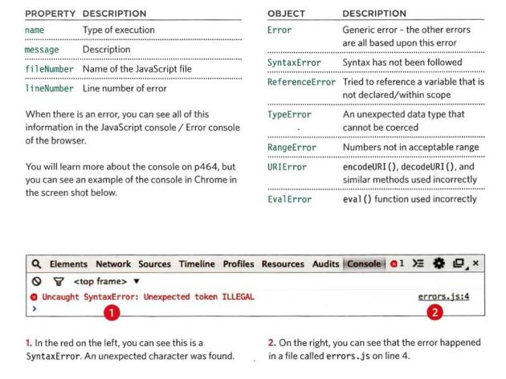
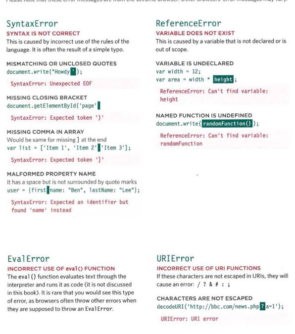
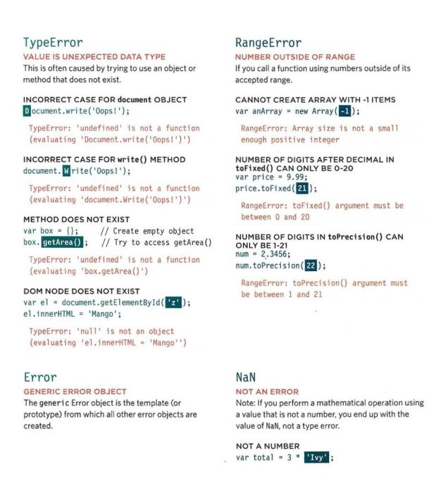
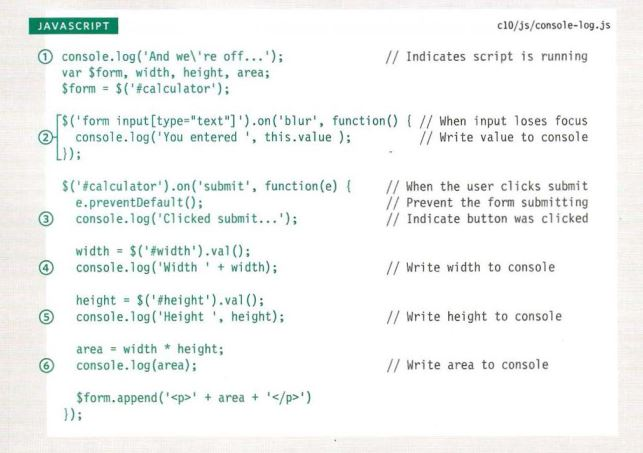
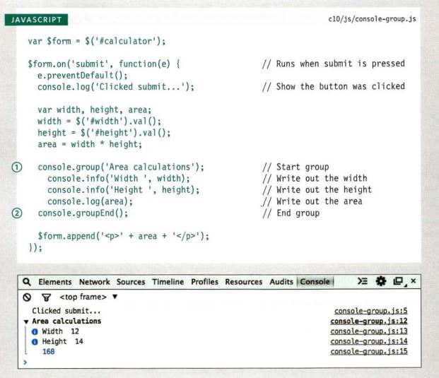

# *Debugging*

- *ERROR OBJECTS*
Error objects can help you find where your mistakes are
and browsers have tools to help you read them. 

 

 

 

 

 

 

- *HOW TO DEAL WITH
ERRORS*
1.  DEBUG THE SCRIPT TO FIX ERRORS.
1.  HANDLE ERRORS GRACEFULLY.

- *LOGGING DATA
TO THE CONSOLE*

 

 

 

 

[Back to homepage](./home/tamara/Reading-notes/README)