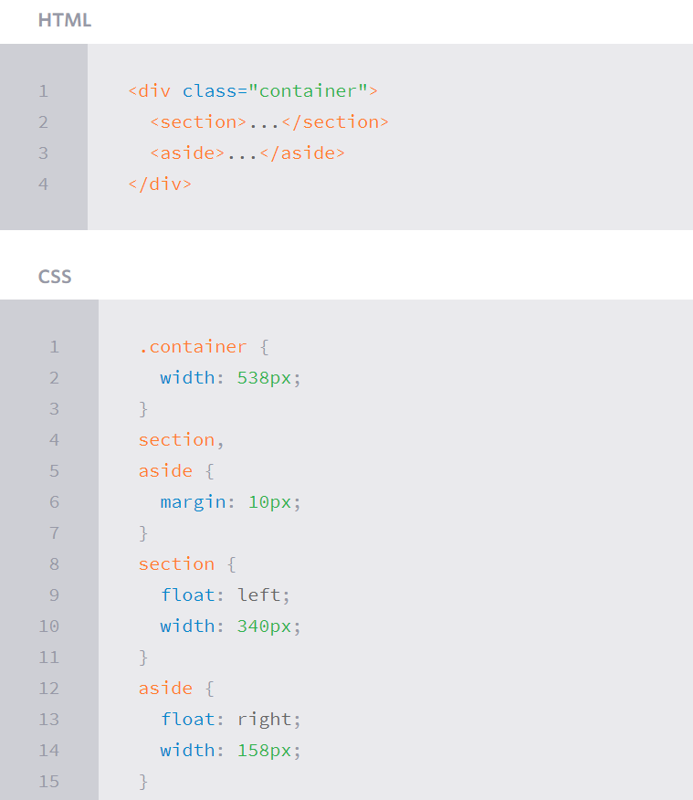
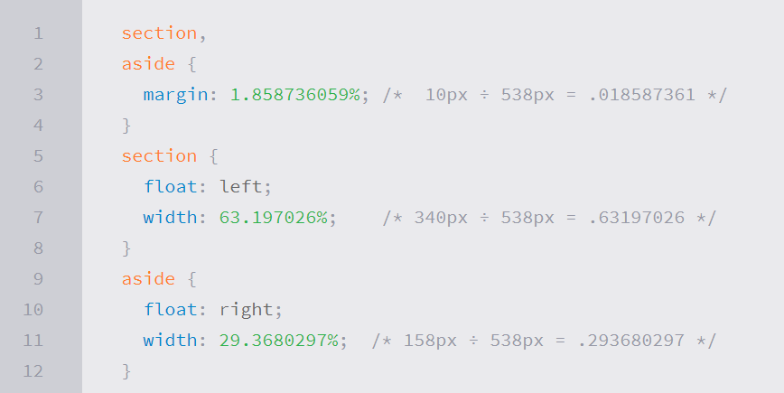
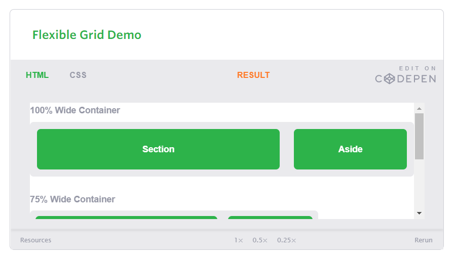
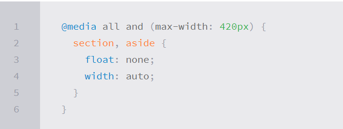
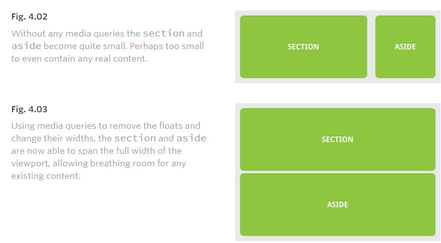
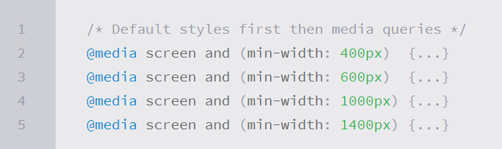
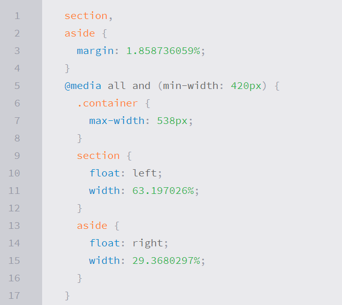
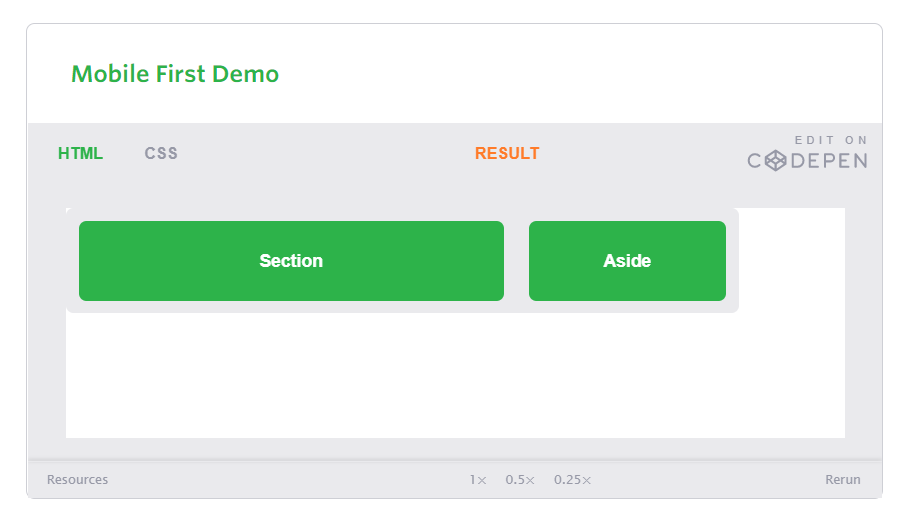
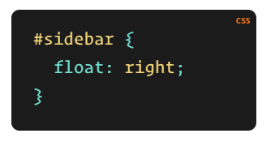
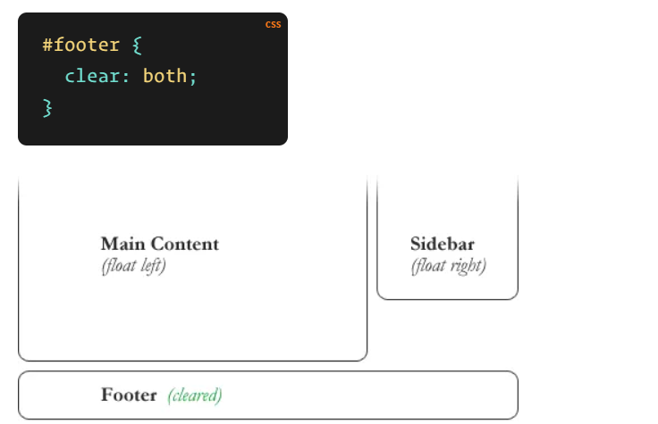

# SMACSS and Responsive Web Design

## _Responsive Overview_
Responsive web design is the practice of building a website suitable to work on every device and every screen size, no matter how large or small, mobile or desktop. Responsive web design is focused around providing an intuitive and gratifying experience for everyone. Desktop computer and cell phone users alike all benefit from responsive websites.

## Responsive vs. Adaptive vs. Mobile
Responsive generally means to react quickly and positively to any change, while adaptive means to be easily modified for a new purpose or situation, such as change. With responsive design websites continually and fluidly change based on different factors, such as viewport width, while adaptive websites are built to a group of preset factors. A combination of the two is ideal, providing the perfect formula for functional websites. Which term is used specifically doesn’t make a huge difference.<br>

Mobile, on the other hand, generally means to build a separate website commonly on a new domain solely for mobile users. While this does occasionally have its place, it normally isn’t a great idea. Mobile websites can be extremely light but they do come with the dependencies of a new code base and browser sniffing, all of which can become an obstacle for both developers and users. <br>

Currently the most popular technique lies within responsive web design, favoring design that dynamically adapts to different browser and device viewports, changing layout and content along the way. This solution has the benefits of being all three, responsive, adaptive, and mobile.<br>

Responsive web design is broken down into three main components, including flexible layouts, media queries, and flexible media.

### Flexible Layouts
```Relative Viewport Lengths
CSS3 introduced some new relative length units, specifically related to the viewport size of the browser or device. These new units include vw, vh, vmin, and vmax. Overall support for these new units isn’t great, but it is growing. In time they look to play a large roll in building responsive websites.

vw: Viewports widthvh
vh: Viewports heightvmin
vmin: Minimum of the viewport’s height and widthvmax
vmax: Maximum of the viewport’s height and width

```
Flexible layouts do not advocate the use of fixed measurement units, such as pixels or inches. Reason being, the viewport height and width continually change from device to device. 

The formula is based around taking the target width of an element and dividing it by the width of it’s parent element. The result is the relative width of the target element.


### Flexible Grid
Let’s see how this formula works inside of a two column layout. Below we have a parent division with the class of container wrapping both the section and aside elements. The goal is to have have the section on the left and the aside on the right, with equal margins between the two. Normally the markup and styles for this layout would look a bit like the following.


<br>


***

<br>




### Media Queries
Media queries were built as an extension to media types commonly found when targeting and including styles. Media queries provide the ability to specify different styles for individual browser and device circumstances, the width of the viewport or device orientation for example. Being able to apply uniquely targeted styles opens up a world of opportunity and leverage to responsive web design.<br>

*Initializing Media Queries* <br>
There are a couple different ways to use media queries, using the @media rule inside of an existing style sheet, importing a new style sheet using the @import rule, or by linking to a separate style sheet from within the HTML document. Generally speaking it is recommend to use the @media rule inside of an existing style sheet to avoid any additional HTTP requests.

Media Queries Demo: <br>





### Mobile First
One popular technique with using media queries is called mobile first. The mobile first approach includes using styles targeted at smaller viewports as the default styles for a website, then use media queries to add styles as the viewport grows.<br>

A breakout of mobile first media queries might look at bit like the following.

Mobile First Demo: <br>





# All About Floats
Float is a CSS positioning property. To understand its purpose and origin, we can look to print design. In a print layout, images may be set into the page such that text wraps around them as needed. This is commonly and appropriately called “text wrap”.<br>

In web design, page elements with the CSS float property applied to them are just like the images in the print layout where the text flows around them. Floated elements remain a part of the flow of the web page. This is distinctly different than page elements that use absolute positioning. Absolutely positioned page elements are removed from the flow of the webpage, like when the text box in the print layout was told to ignore the page wrap. Absolutely positioned page elements will not affect the position of other elements and other elements will not affect them, whether they touch each other or not.

Setting the float on an element with CSS happens like this:



There are four valid values for the float property. Left and Right float elements those directions respectively. None (the default) ensures the element will not float and Inherit which will assume the float value from that elements parent element.


*Clearing the Float* <br>
Float’s sister property is clear. An element that has the clear property set on it will not move up adjacent to the float like the float desires, but will move itself down past the float. Again an illustration probably does more good than words do.




*The Great Collapse* <br>
One of the more bewildering things about working with floats is how they can affect the element that contains them (their “parent” element). If this parent element contained nothing but floated elements, the height of it would literally collapse to nothing. This isn’t always obvious if the parent doesn’t contain any visually noticeable background, but it is important to be aware of.


*Techniques for Clearing Floats* <br>
1. The Empty Div Method . `<div style="clear: both;"></div>`
1. The Overflow Method. 
1. The Easy Clearing Method `:after`
