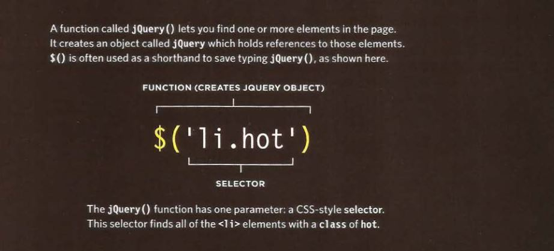
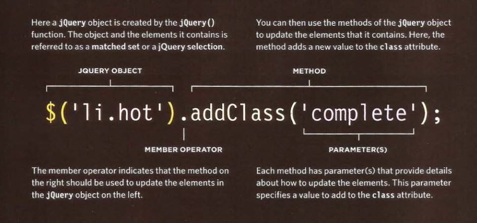
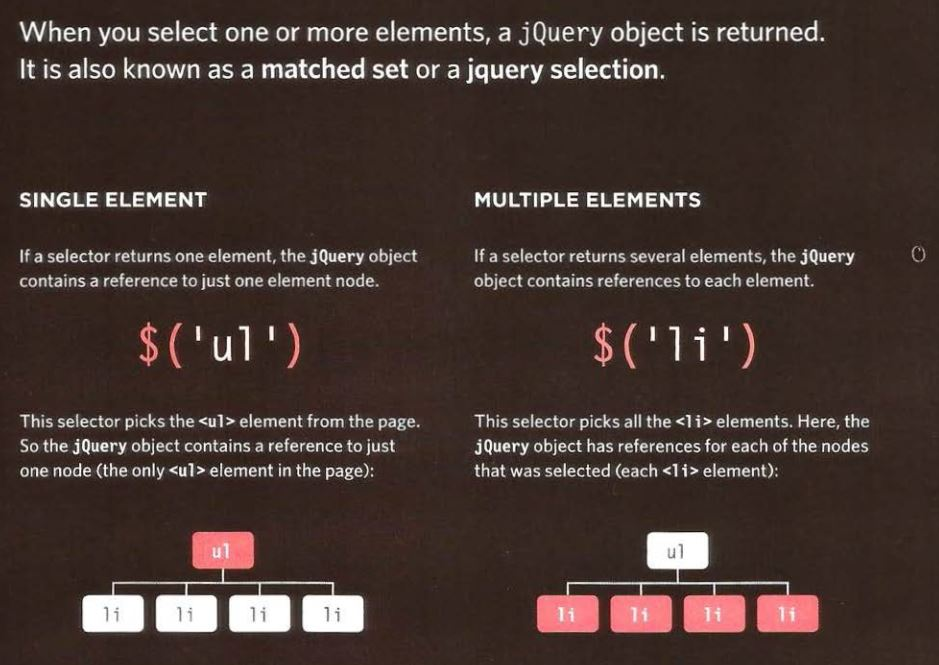
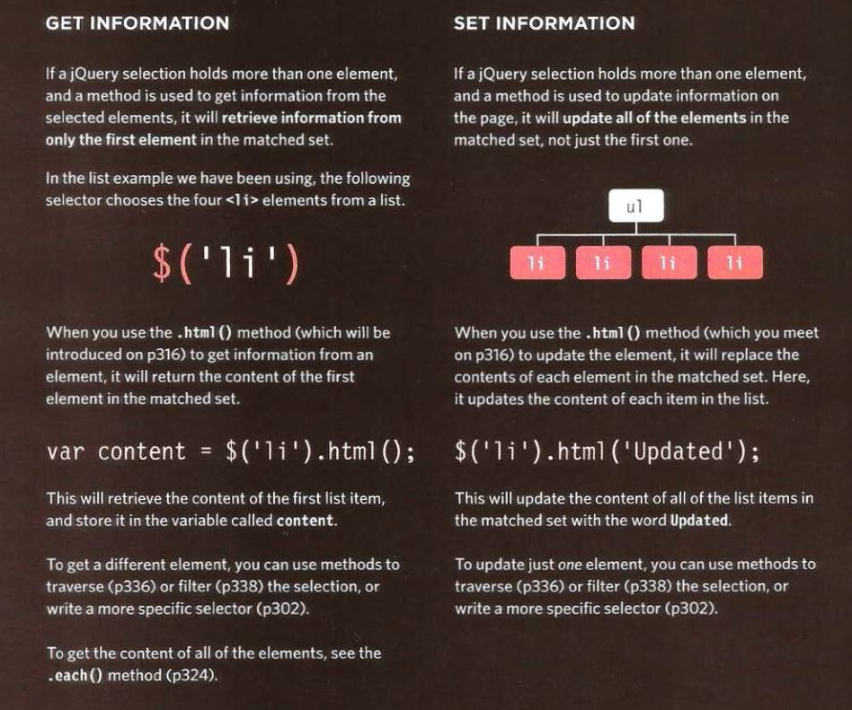
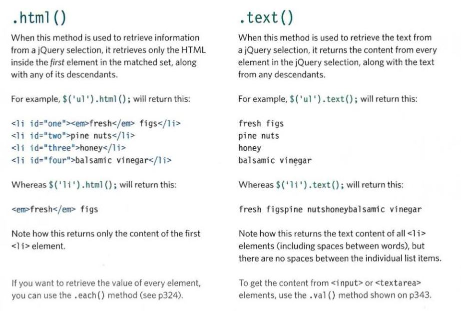
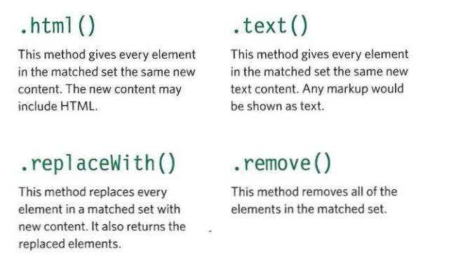
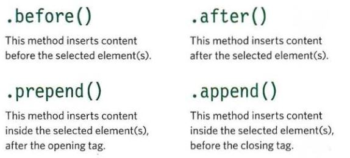
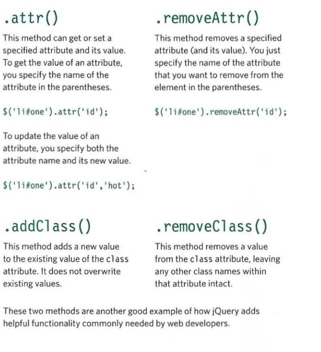
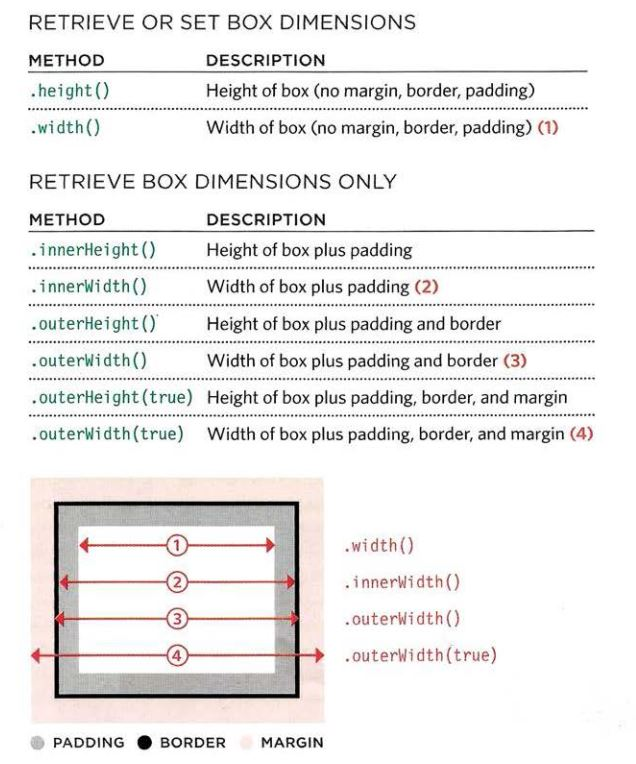
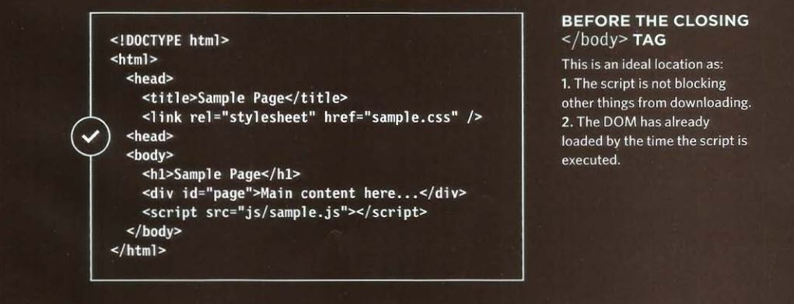

# JavaScript and jQuery, Pair Programming

jQuery is a javascript file that you can include in your webpages.
## Find elements using CSS-style selectors:

## Do something with the element using jQuery methods:

## Matched Set /jQuery selection

## jQuery methods that get and set data:

## Getting element content:

## Updating Elements:

## Inserting Elements:

## Getting and setting attributes:

## Getting and setting CSS properties:
To get the value of a CSS
property, you indicate which
property you want to retrieve in
parentheses. If the matched set
contains more than one element,
it will return the value from the
first element. 

To set the values of a CSS
property, you specify the
property name as the first
argument in the parentheses,
then a comma, followed by its
value as the second argument.
This will update every element
in the matched set. You can also
specify multiple properties in the
same method using object literal
notation.  

## Box Dimensions
These methods allow you to discover or update
the width and height of all boxes on the page.  

## The position of script:
It can affect
how quickly a web page seems to load.  

## ***Pair Programming***

More “two heads are better than one” than “stop reading over my shoulder,” pair programming is the practice of two developers sharing a single workstation to interactively tackle a coding task together.  
There are 6 Reasons for Pair Programming:
1. Greater efficiency.
1. Engaged collaboration.
1. Learning from fellow students.
1. Social skills.
1. Job interview readiness.
1. Work environment readiness.