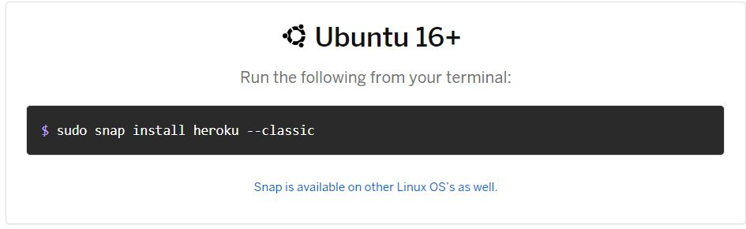
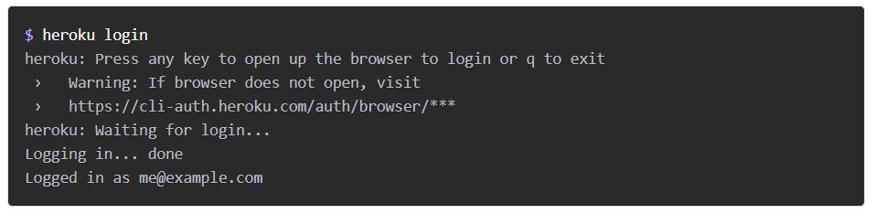
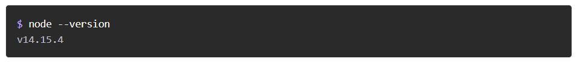
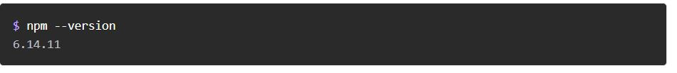
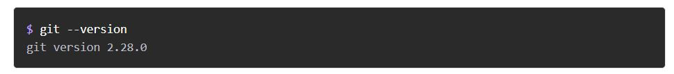
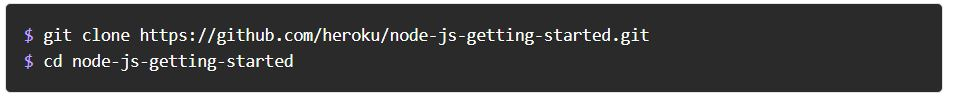
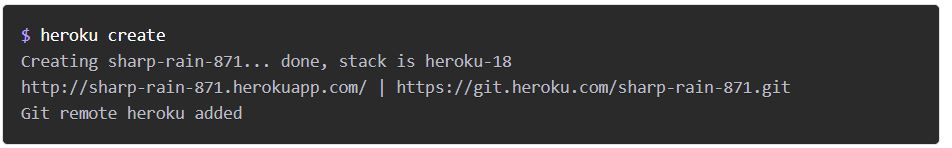
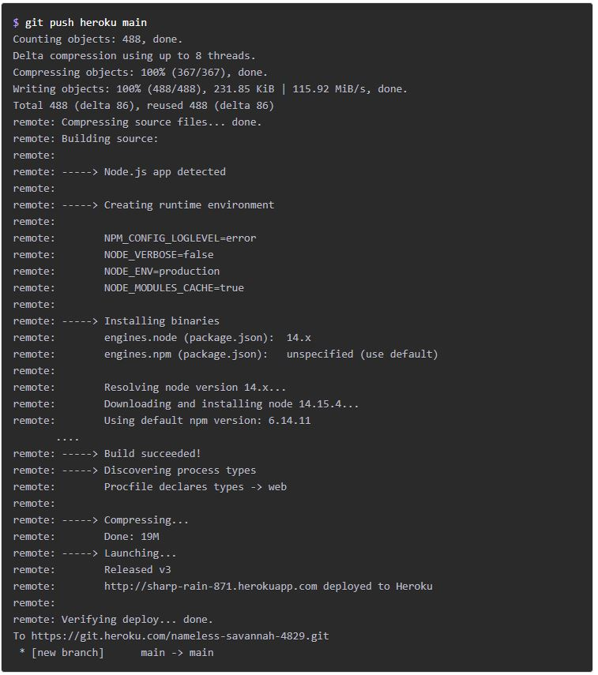

# Getting Started on Heroku with Node.js

## Set up:
In this step you’ll install the Heroku Command Line Interface (CLI). You use the CLI to manage and scale your applications, provision add-ons, view your application logs, and run your application locally.

Download and run the installer for your platform:

 

When installation completes, you can use the ``heroku`` command from your terminal.

On Windows, start the Command Prompt (cmd.exe) or Powershell to access the command shell.
Use the ``heroku login`` command to log in to the Heroku CLI:

## Prepare the app:
In this step, you will prepare a sample application that’s ready to be deployed to Heroku.

- To clone a local version of the sample application that you can then deploy to Heroku, execute the following commands in your local command shell or terminal:

## Deploy the app:
In this step you will deploy the app to Heroku.

Create an app on Heroku, which prepares Heroku to receive your source code.

When you create an app, a git remote (called ``heroku``) is also created and associated with your local git repository.

Heroku generates a random name (in this case sharp-rain-871) for your app, or you can pass a parameter to specify your own app name.

Now deploy your code:

The application is now deployed. Ensure that at least one instance of the app is running:
``heroku ps:scale web=1``

Now visit the app at the URL generated by its app name. As a handy shortcut, you can open the website as follows:
``heroku open``

## View logs:
Heroku treats logs as streams of time-ordered events aggregated from the output streams of all your app and Heroku components, providing a single channel for all of the events.

View information about your running app using one of the logging commands, heroku ``logs --tail``

Visit your application in the browser again, and you’ll see another log message generated.

Press ``Control+C ``to stop streaming the logs.
