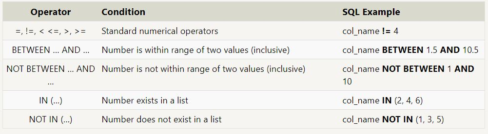
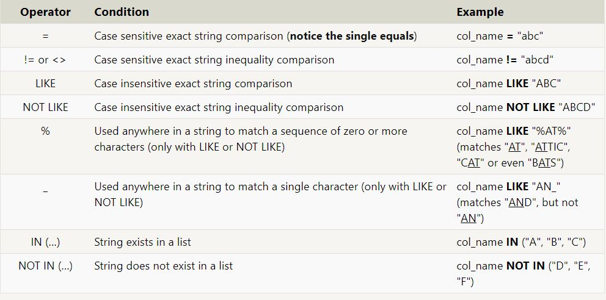

# SQL

SQL, or Structured Query Language, is a language designed to allow both technical and non-technical users query, manipulate, and transform data from a relational database. And due to its simplicity, SQL databases provide safe and scalable storage for millions of websites and mobile applications.

## Select queries

To retrieve data from a SQL database, we need to write SELECT statements, which are often colloquially referred to as queries. A query in itself is just a statement which declares what data we are looking for, where to find it in the database, and optionally, how to transform it before it is returned. 

```
Select query for a specific columns
SELECT column, another_column, …
FROM mytable;
```
The result of this query will be a two-dimensional set of rows and columns, effectively a copy of the table, but only with the columns that we requested.

f we want to retrieve absolutely all the columns of data from a table, we can then use the asterisk (*) shorthand in place of listing all the column names individually.
```
Select query for all columns
SELECT * 
FROM mytable;
```

## Queries with constraints

In order to filter certain results from being returned, we need to use a WHERE clause in the query. The clause is applied to each row of data by checking specific column values to determine whether it should be included in the results or not.




```
Select query with constraints
SELECT column, another_column, …
FROM mytable
WHERE condition
    AND/OR another_condition
    AND/OR …;
```

When writing WHERE clauses with columns containing text data, SQL supports a number of useful operators to do things like case-insensitive string comparison and wildcard pattern matching. We show a few common text-data specific operators below:




We should note that while most database implementations are quite efficient when using these operators, full-text search is best left to dedicated libraries like Apache Lucene or Sphinx. These libraries are designed specifically to do full text search, and as a result are more efficient and can support a wider variety of search features including internationalization and advanced queries.


Here's the definition of a query with a WHERE clause again, go ahead and try and write some queries with the operators above to limit the results to the information we need in the tasks below.

```
Select query with constraints
SELECT column, another_column, …
FROM mytable
WHERE condition
    AND/OR another_condition
    AND/OR …;
```

Filtering and sorting Query results:

Even though the data in a database may be unique, the results of any particular query may not be – take our Movies table for example, many different movies can be released the same year. In such cases, SQL provides a convenient way to discard rows that have a duplicate column value by using the DISTINCT keyword.
```
Select query with unique results
SELECT DISTINCT column, another_column, …
FROM mytable
WHERE condition(s);
```

Since the DISTINCT keyword will blindly remove duplicate rows, we will learn in a future lesson how to discard duplicates based on specific columns using grouping and the GROUP BY clause.
