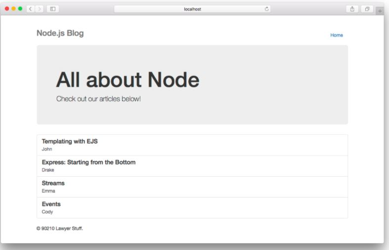
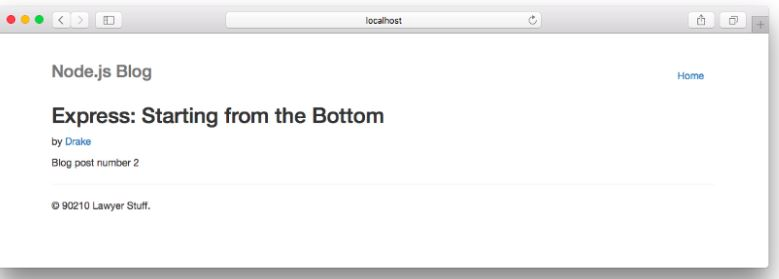

# Components
Partials come in handy when you want to reuse the same HTML across multiple views. Think of partials as functions, they make large websites easier to maintain as you don’t have to go and change a piece of text in every page it appears in. Instead, you define that reusable bundle of code in a file and include it wherever you need it.

for example, we have two pages the first one us the home page and the other one in POST page:
<br> 


<br>



as you can see the same navigation bar and footer appear in both the home and post view. This makes them perfect candidates for partials!

Under the views/partials/ directory create a file called `navbar.ejs` which will contain only the HTML for the navigation bar at the top of the home and post pages:
```
<!-- views/partials/navbar.ejs -->
    <div class="header clearfix">
        <nav>
            <ul class="nav nav-pills pull-right">
                <li role="presentation"><a href="/">Home</a></li>
            </ul>
            <h3 class="text-muted">Node.js Blog</h3>
        </nav>
    </div>
```

and a file called `footer.ejs` in that same directory:
```
<!-- views/partials/footer.ejs -->
    <footer class="footer">
        <p>© 90210 Lawyer Stuff.</p>
    </footer>
```
Now that we have our partials defined, we can use them in our home.ejs and post.ejs templates! In EJS, any JavaScript or non-HTML syntax you include in your templates is always surrounded by <% %> delimiters.

 create the homepage template in views/home.ejs and include the navbar and footer partial we just created:

 ```
 <!-- views/home.ejs -->
    <!DOCTYPE html>
    <html>
    <head>
        <meta charset="utf-8">
        <title>Node.js Blog</title>
        <link rel="stylesheet" href="https://maxcdn.bootstrapcdn.com/bootstrap/3.3.6/css/bootstrap.min.css">
        <style>
            body {
                padding-top: 20px;
                padding-bottom: 20px;
            }
            .jumbotron {
              margin-top: 10px;
            }
        </style>
    </head>
    <body>
        <div class="container">
            <%- include('partials/navbar') %>
            <div class="jumbotron">
                <h1>All about Node</h1>
                <p class="lead">Check out our articles below!</p>
            </div>
            <div class="row">
                <div class="col-lg-12">
                    <div class="list-group">
                      <!-- loop over blog posts and render them -->
                      LIST_OF_POSTS
                    </div>
                </div>
            </div>
            <%- include('partials/footer') %>
        </div>
    </body>
    </html>
```
and for the post page in `views/post.ejs`:  
```
<!-- views/post.ejs -->
    <!DOCTYPE html>
    <html>
    <head>
        <meta charset="utf-8">
        <title>POST_TITLE | Node.js Blog</title>
        <link rel="stylesheet" href="https://maxcdn.bootstrapcdn.com/bootstrap/3.3.6/css/bootstrap.min.css">
        <style>
            body {
                padding-top: 20px;
                padding-bottom: 20px;
            }
        </style>
    </head>
    <body>
        <div class="container">
            <%- include('partials/navbar') %>
            <div>
                <h2>POST_TITLE</h2>
                <p>by <a href="#">POST_AUTHOR</a></p>
                <p>POST_CONTENT</p>
                <hr>
            </div>
            <%- include('partials/footer') %>
        </div>
    </body>
    </html>
```
  

Including a partial in EJS is quite straightforward. You use `<%- include( PARTIAL_FILE ) %>` where the partial file is relative to the template you use it in.

### What are Observables?
Observables are similar to promises but with major differences that make them better.

Observables are a new primitive coming with ES7 (ES2016) that helps handle asynchronous actions and events.

