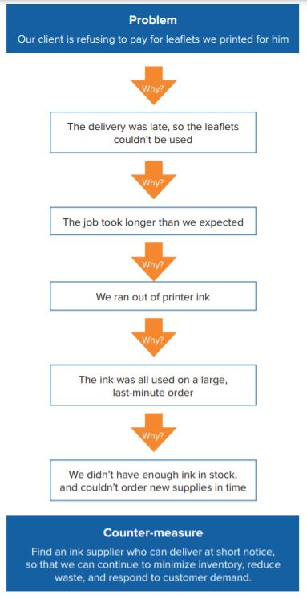
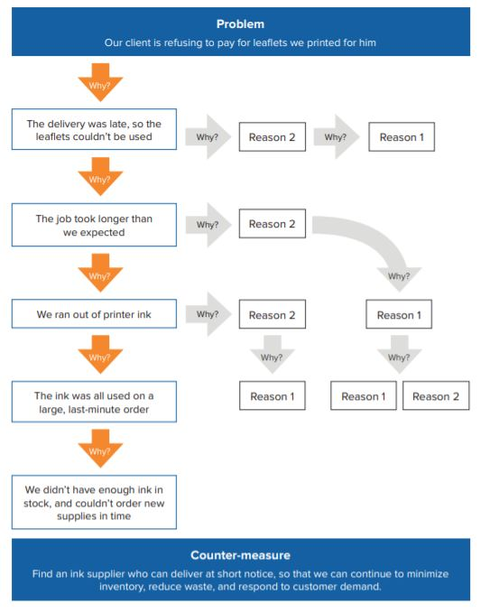

# Basics for Programmers

I'll mention  important topics for any programmer in the world which make their lives much easier if they knew about them!

### *How to Solve Programming Problems*

1. **Read the problem completely twice:**  
   This is the single most important step.  You may even want to read the problem 3 or 4 times. 
   You want to make sure you completely understand the problem.  A good test of this is whether or not you can explain the problem to someone else.
1. **Solve the problem manually:**  
   > “Nothing can be automated that cannot be done manually!”    

   It is very important to solve the problem manually first, so that you know what you are going to automate, otherwise you are just slinging code around. 
1. **Optimize the manual solution:**   
   What you want to do here is figure out if there is another way you can solve the problem easier, or if there are some steps you can cut our or simplify.
1. **Write pseudo-code or comments:**  
   What we want to do here is capture all the steps we created and now either put them into our editor as comments or write them as psuedo-code that we can translate to real code.  
1. **Replace comments with real code:**  
   This step should be extremely easy at this point.  If you have done all the other steps, this step involves no problem solving at all.

1. **Optimize the real code:**  
   This is a good place to make sure all your variables are named with long meaningful names.  I cannot stress enough how important having good names for your variables and methods is for helping the person evaluating your code to understand what you were trying to do.  This is especially important when you make a mistake!  

  # Pretend Your Time is Worth $1,000/Hour and You’ll Become 100x More Productive 
  
 

  >“Pretend your time is worth $1,000/hr. Would you spend five of them doing extra work for free? Would you waste one on being angry?” -
Niklas Göke. 

Many people could be making a fortune (if they used their time well)…but instead, they give away their time in unproductive ways that leave them broke, unhappy, and stuck.

If you let it, your world and the people around you will take all your time. Your time is not unlike your paycheck; if you don’t budget for things, you’ll have nothing left over by the end of the month.

This  is how lives are wasted — by doing thankless work for ungrateful takers that didn’t deserve your time in the first place.

We’re all busy — with work, our families, our friends. It’s not bad to be “busy.” 

#### Busyness and Stress Are the Enemy

>“Being busy is a form of mental laziness.” -Tim Ferriss

Extremely successful people don’t tolerate busywork or distraction. They have crystal clear vision on their goals, and do what they need to do to get there, every single day.

If you don’t treat yourself and your time with respect, you will become unhappy, resentful, and tired. Your body and mind long for mastery and freedom; you can’t have those things if your time is cheap and easily taken.
Treat your time as a valuable commodity, and people will begin to treat it like that, too.

Every time you say yes to something, it means you’re saying “no” to a dozen other opportunities. The world’s most successful and extraordinary people say no to almost everything, but yes to a few things.Those few things determine their career, legacy, and livelihood.

### In Conclusion:

>“Living in frenzy is a sign we’ve squandered too much.” -Niklas Goke.

Value your time at what it deserves to be. The higher the value, the more important and productive work you’ll do — and the less trivial and mindless tasks you’ll get caught in.

# How to think like a programmer — lessons in problem solving

what should you do when you encounter a new problem?

Here are the steps:
1. **Understand**   
Know exactly what is being asked. Most hard problems are hard because you don’t understand them (hence why this is the first step).

1. **Plan**  
Don’t dive right into solving without a plan (and somehow hope you can muddle your way through). Plan your solution

     In programming, this means don’t start hacking straight away. Give your brain time to analyze the problem and process the information.

1. **Divide**  
Pay attention. This is the most important step of all.

    Do not try to solve one big problem. You will cry.

   Instead, break it into sub-problems. These sub-problems are much easier to solve.
  Then, solve each sub-problem one by one. Begin with the simplest. Simplest means you know the answer (or are closer to that answer).

    After that, simplest means this sub-problem being solved doesn’t depend on others being solved.

   Once you solved every sub-problem, connect the dots.

   Connecting all your “sub-solutions” will give you the solution to the original problem. Congratulations!  

1. **Stuck?**  
   - Debug: Go step by step through your solution trying to find where you went wrong. Programmers call this debugging (in fact, this is all a debugger does).
   - Reassess: Take a step back. Look at the problem from another perspective. Is there anything that can be abstracted to a more general approach?
   - Research: Ahh, good ol’ Google. You read that right. No matter what problem you have, someone has probably solved it. Find that person/ solution. In fact, do this even if you solved the problem! (You can learn a lot from other people’s solutions).

# 5 Whys

Getting to the Root of a Problem Quickly: Stubborn or recurrent problems are often symptoms of deeper issues. "Quick fixes" may seem convenient, but they often solve only the surface issues and waste resources that could otherwise be used to tackle the real cause.  

**Origins of the 5 Whys Technique:**  
Sakichi Toyoda, the Japanese industrialist, inventor, and founder of Toyota Industries, developed the 5 Whys technique in the 1930s. It became popular in the 1970s, and Toyota still uses it to solve problems today.

The method is remarkably simple: when a problem occurs, you drill down to its root cause by asking "Why?" five times. Then, when a counter-measure becomes apparent, you follow it through to prevent the issue from recurring.
**When to Use a 5 Whys Analysis**  
You can use 5 Whys for troubleshooting, quality improvement, and problem solving, but it is most effective when used to resolve simple or moderately difficult problems.  

**How to Use the 5 Whys**  

1. Assemble a Team.
1.  Define the Problem.
1.  Ask the First "Why?".
1.  Ask "Why?" Four More Times.

     The diagram, below, shows an example of 5 Whys in  action, following a single lane of inquiry.
      **Figure 1: 5 Whys Example (Single Lane)**

       
     **Figure 2: 5 Whys Example (Multiple Lanes)**
       

1. Know When to Stop.
1. Address the Root Cause(s).
1. Monitor Your Measures.

he 5 Whys strategy is a simple, effective tool for uncovering the root of a problem. You can use it in troubleshooting, problem-solving, and quality-improvement initiatives.

Start with a problem and ask why it is occurring. Make sure that your answer is grounded in fact, and then ask the question again. Continue the process until you reach the root cause of the problem, and you can identify a counter-measure that will prevent it from recurring.

Bear in mind that this questioning process is best suited to simple or moderately difficult problems. Complex problems may benefit from a more detailed approach, although using 5 Whys will still give you useful insights.

