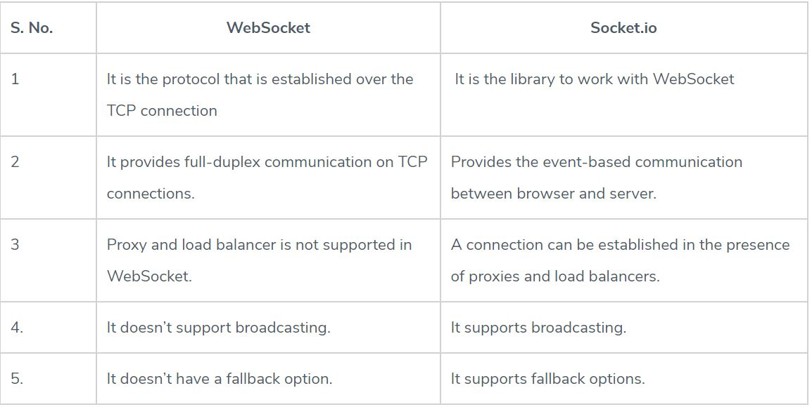

# Socket.io

## Review, Research, and Discussion

### What is the benefit of transforming data into packets?

TDM-based networks must transform into packet-based networks to meet the demands of pervasive data-centric applications and services. Packet-based networks not only enable new innovations, services, and business opportunities, they are also the most cost-effective, efficient, and scalable networks for content delivery.  

### UDP is often referred to as a connection less protocol. Why is this?

Because it allows data to be exchanged without setting up a link between processes. Each unit of data, with all the necessary information to route it to the intended destination, is transferred independent of other data packets and can travel over different paths to reach the final destination. Some data packets might be lost in transmission or might arrive out of sequence to other data packets. 

### Can a socket server application have multiple socket connections?

A server socket listens on a single port. ... Multiple connections on the same server can share the same server-side IP/Port pair as long as they are associated with different client-side IP/Port pairs, and the server would be able to handle as many clients as available system resources allow it to. 

###  Can a socket connection application be connected to multiple socket servers?

If a client has many connections to the same port on the same destination, then three of those fields will be the same — only source_port varies to differentiate the different connections. Ports are 16-bit numbers, therefore the maximum number of connections any given client can have to any given host port is 64K. 

### Can an application be both a socket server and a socket connection?

Yes!  

## Terms

### Observer Pattern
It is a software design pattern in which an object, named the subject, maintains a list of its dependents, called observers, and notifies them automatically of any state changes, usually by calling one of their methods. 

It is mainly used for implementing distributed event handling systems, in "event driven" software. In those systems, the subject is usually named a "stream of events" or "stream source of events", while the observers are called "sinks of events".  

### Event Handler
 scripts that are automatically executed when an event occurs. Event handlers are embedded in documents as attributes of HTML tags to which you assign JavaScript code to execute. 

### Event Driven Programming
s when a program is designed to respond to user engagement in various forms. It is known as a programming paradigm in which the flow of program execution is determined by “events.” Events are any user interaction, such as a click or key press, in response to prompt from the system. 

### Event Loop
It is a programming construct or design pattern that waits for and dispatches events or messages in a program. 

### Event Queue
It is responsible for sending new functions to the track for processing. It follows the queue data structure to maintain the correct sequence in which all operations should be sent for execution. Whenever an async function is called, it is sent to a browser API. These are APIs built into the browser. 

### Call Stack 
It is used for several related purposes, but the main reason for having one is to keep track of the point to which each active subroutine should return control when it finishes executing. An active subroutine is one that has been called.  

### Database
It is an organized collection of data, generally stored and accessed electronically from a computer system. Where databases are more complex they are often developed using formal design and modeling techniques.
 

## Preparation Materials

WebSocket is a computer communications protocol, providing full-duplex communication channels over a single TCP connection. The WebSocket protocol was standardized by the IETF as RFC 6455 in 2011, and the WebSocket API in Web IDL is being standardized by the W3C.  

The WebSocket protocol enables interaction between a web browser (or other client application) and a web server with lower overhead than half-duplex alternatives such as HTTP polling, facilitating real-time data transfer from and to the server. 

### Difference Between WebSocket and Socket.io

WebSocket allow real-time data transfer. When clients trigger the request to the server, it does not close the connection on receiving the response; it rather persists and waits for the Client or server to terminate the request.

Socket.IO is a library that enables real-time and full-duplex communication between the Client and the Web servers. It uses the WebSocket protocol to provide the interface. Generally, it is divided into two parts; both WebSocket vs Socket.io are event-driven libraries.

Client-Side: it is the library that runs inside the browser
Server Side: It is the library for Node.js

### WebSocket vs Socket.io Comparison Table

