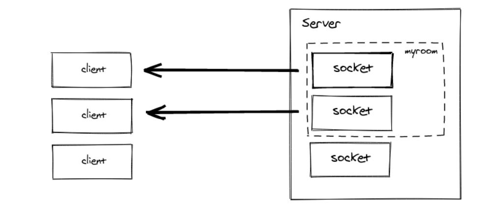

# Message Queues

## Review, Research, and Discussion

### What does it mean that web sockets are bidirectional? Why is this useful?

Whereas HTTP relies on a client request to receive a response from the server for every exchange, WebSockets allow for full-duplex bidirectional communication. This enables the server to send real-time updates asynchronously, without requiring the client to submit a request each time.  

### Does socket.io use HTTP? Why?

the initial connection setup it done over HTTP. Also, a socket.io server will attach to an HTTP server so it can serve its own client code through /socket.io/socket.io.js . 

### What happens when a client emits an event?

The event will be sent to the server, which will be listening for the event if already connected. 

### What happens when a server emits an event?

The event gets passed to the server through websockets. Its a tcp connection from the browser to the server. The connection is full duplex meaning the server can send real time data to the client and vise versa. 

### What happens if a client “misses” an event??

Unhandled messages are just ignored. It's just like when an event occurs and there are no event listeners for that event. The socket receives the msg and doesn't find a handler for it so nothing happens with it.  

### How can we mitigate this?

Can avoid missing an event by always having handlers installed and then deciding in the handlers whether to do anything with the message or not.   

## Terms

### Socket

It is a software structure within a network node of a computer network that serves as an endpoint for sending and receiving data across the network. The structure and properties of a socket are defined by an application programming interface (API) for the networking architecture. Sockets are created only during the lifetime of a process of an application running in the node. 

### WebSocket

 It is a computer communications protocol, providing full-duplex communication channels over a single TCP connection. The WebSocket protocol was standardized by the IETF as RFC 6455 in 2011, and the WebSocket API in Web IDL is being standardized by the W3C.

### Socket.io

It's a library in node js enables real-time, bidirectional and event-based communication.
It works on every platform, browser or device, focusing equally on reliability and speed.. 

### Client

It's a piece of computer hardware or software that accesses a service made available by a server as part of the client–server model of computer networks.. 

### Server
It is computer hardware or software that provides functionality for other programs or devices. 

### OSI Model
It is The Open Systems Interconnection model (OSI model) is a conceptual model that characterises and standardises the communication functions of a telecommunication or computing system without regard to its underlying internal structure and technology. Its goal is the interoperability of diverse communication systems with standard communication protocols. 

### TCP Model
It  is a concise version of the OSI model. It contains four layers, unlike seven layers in the OSI model.  

### TCP
Transmission Control Protocol (TCP) is one of the main protocols of the Internet protocol suite.

### UDP
 User Datagram Protocol (UDP) – a communications protocol that facilitates the exchange of messages between computing devices in a network.

### Packets
a packet is a small segment of a larger message. Data sent over computer networks*, such as the Internet, is divided into packets.

 

## Preparation Materials

### Rooms

A room is an arbitrary channel that sockets can `join` and `leave`. It can be used to broadcast events to a subset of clients:  

 

- the rooms are a server-only concept (i.e. the client does not have access to the list of rooms it has joined). 

- We can call join to subscribe the socket to a given channel. 
  
- use to or in (they are the same) when broadcasting or emitting. 

- You can emit to several rooms at the same time. 

### Default room

Each Socket in Socket.IO is identified by a random, unguessable, unique identifier Socket#id. For your convenience, each socket automatically joins a room identified by its own id.

### Room events
Starting with socket.io@3.1.0, the underlying Adapter will emit the following events:

- create-room (argument: room).
- delete-room (argument: room).
- join-room (argument: room, id).
- leave-room (argument: room, id).
